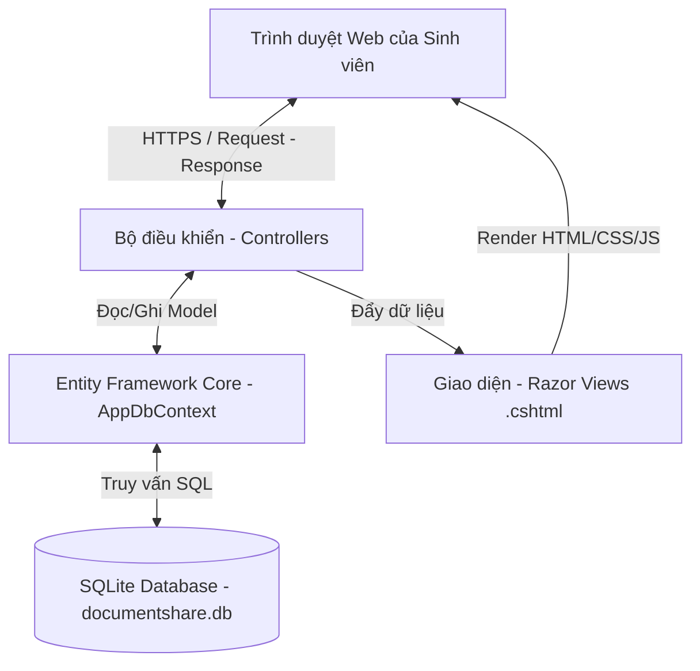
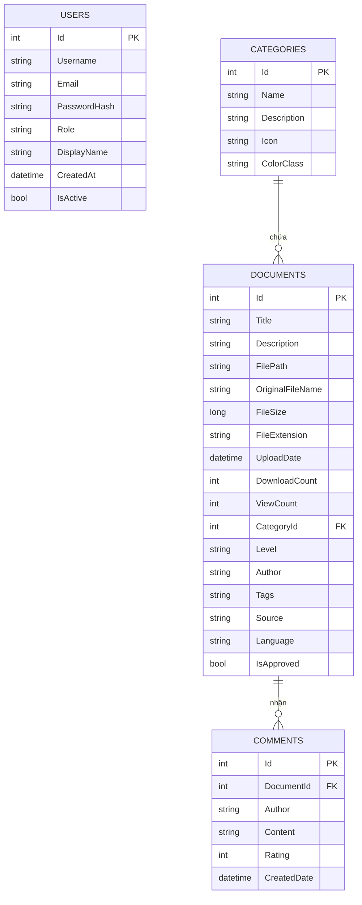

# BÁO CÁO ĐỀ TÀI MÔN HỌC: CÔNG NGHỆ WEB
## ĐỀ TÀI: XÂY DỰNG WEBSITE CHIA SẺ TÀI LIỆU HỌC TẬP CHO SINH VIÊN HỌC VIỆN KỸ THUẬT QUÂN SỰ (HAUDOCSSHARE)

---

## THÔNG TIN CHUNG
* **Tên đề tài:** HAUDOCSSHARE - Hệ thống chia sẻ tài liệu học tập số cho sinh viên Học viện Kỹ thuật Quân sự (MTA)
* **Môn học:** Công nghệ Web
* **Môi trường phát triển:** ASP.NET Core 10 (C#), Entity Framework Core, SQLite, HTML5/CSS3 (Claymorphism & Glassmorphism UI)
* **Mục tiêu:** Xây dựng nền tảng trao đổi tri thức, tài liệu số hóa tập trung, an toàn và dễ tiếp cận cho sinh viên MTA.

---

## LỜI MỞ ĐẦU

Trong bối cảnh chuyển đổi số đang diễn ra mạnh mẽ tại các cơ sở giáo dục đại học trên cả nước nói chung và Học viện Kỹ thuật Quân sự nói riêng, nhu cầu tiếp cận nguồn tài nguyên học tập một cách nhanh chóng, thuận tiện và hiệu quả ngày càng trở nên cấp thiết đối với sinh viên. Học tập trong môi trường kỹ thuật quân sự đòi hỏi lượng kiến thức chuyên môn đồ sộ, các giáo trình chuyên ngành sâu, tài liệu thực hành và các bài tập lớn phức tạp. 

Tuy nhiên, thực tế cho thấy phần lớn tài liệu học tập giá trị hiện nay vẫn còn phân tán, thiếu tính hệ thống. Sinh viên thường chia sẻ tài liệu qua các nhóm mạng xã hội nhỏ lẻ (như Facebook, Zalo, Telegram), dẫn đến việc tài liệu dễ bị trôi mất, khó tìm kiếm lại, và không được tổ chức theo môn học hay ngành học một cách khoa học. Đồng thời, sinh viên khóa dưới thường gặp nhiều khó khăn trong việc tiếp cận các tài liệu ôn thi, bài giảng hay kinh nghiệm học tập từ các khóa đàn anh đi trước.

Với niềm tin cốt lõi: **"Tri thức chỉ thực sự có giá trị khi được chia sẻ"**, nhóm chúng em đã quyết định thực hiện đề tài **HAUDOCSSHARE** — một website chia sẻ tài liệu học tập được thiết kế và tối ưu hóa dành riêng cho cộng đồng sinh viên Học viện Kỹ thuật Quân sự. Hệ thống này không chỉ giải quyết bài toán lưu trữ và tìm kiếm tài liệu trực quan, mà còn hướng tới mục tiêu xây dựng một cộng đồng học tập số năng động, kết nối các khóa sinh viên thông qua các tính năng đánh giá, thảo luận và đóng góp tài liệu.

Báo cáo này sẽ trình bày chi tiết toàn bộ quá trình khảo sát nhu cầu, phân tích thiết kế hệ thống, mô hình cơ sở dữ liệu, quy trình lập trình các chức năng chính, thiết kế giao diện theo phong cách hiện đại và đánh giá hiệu năng cũng như định hướng phát triển của đề tài.

---

## CHƯƠNG 1: KHẢO SÁT THỰC TRẠNG VÀ PHÂN TÍCH NHU CẦU NGƯỜI DÙNG

### 1.1 Khảo sát thực trạng tại Học viện Kỹ thuật Quân sự
Học viện Kỹ thuật Quân sự (MTA) đào tạo nhiều ngành kỹ thuật mũi nhọn bao gồm Công nghệ thông tin, Điện tử viễn thông, Cơ khí, Tự động hóa, Xây dựng,... Số lượng môn học chuyên ngành và cơ sở ngành vô cùng lớn. Qua khảo sát thực tế đối với sinh viên trong Học viện, nhóm thu thập được các kết quả sau:
* **Phương thức tìm kiếm tài liệu hiện tại:** 75% sinh viên tìm tài liệu thông qua việc hỏi xin trực tiếp các khóa trên hoặc tìm kiếm ngẫu nhiên trên các nhóm Facebook; 15% mượn tài liệu tại thư viện truyền thống của Học viện; 10% tự tìm kiếm các nguồn tài liệu mở trực tuyến không chính thống.
* **Khó khăn gặp phải:** Tài liệu tải về bị lỗi font, không khớp với chương trình đào tạo cập nhật của Học viện; link tải chứa quảng cáo độc hại; thiếu các bài giải bài tập lớn hoặc đề thi các năm trước để ôn luyện tập trung.
* **Mong muốn của sinh viên:** Có một hệ thống lưu trữ tập trung, phân loại rõ ràng theo ngành/môn học, cho phép đánh giá chất lượng tài liệu trước khi tải xuống, hỗ trợ cả tài liệu lưu trữ cục bộ và các liên kết video bài giảng từ Google Drive.

### 1.2 Xác định các đối tượng người dùng (Actor)
Hệ thống HAUDOCSSHARE xác định hai nhóm đối tượng người dùng chính:

#### 1.2.1 Thành viên (User/Student)
* **Đăng ký/Đăng nhập:** Tạo tài khoản cá nhân an toàn để lưu trữ lịch sử hoạt động.
* **Tìm kiếm và lọc tài liệu:** Tìm kiếm tài liệu theo từ khóa, ngành học (Category), cấp độ (Cơ bản, Trung cấp, Nâng cao), định dạng file (PDF, Word, Excel, PowerPoint, ZIP, hình ảnh) và ngôn ngữ.
* **Xem chi tiết và xem trước:** Đọc mô tả tài liệu, xem thông tin người đăng, số lượt xem, lượt tải và điểm đánh giá trung bình.
* **Tải xuống tài liệu:** Tải file trực tiếp từ máy chủ hệ thống hoặc chuyển tiếp đến các link video hướng dẫn/Google Drive.
* **Đăng tải tài liệu:** Đóng góp tài liệu mới cho hệ thống (ở trạng thái chờ duyệt).
* **Bình luận và Đánh giá:** Viết nhận xét và chấm điểm (1 - 5 sao) cho tài liệu nhằm nâng cao chất lượng nội dung cộng đồng.

#### 1.2.2 Quản trị viên (Admin)
* **Quản lý phê duyệt tài liệu:** Kiểm duyệt các tài liệu do sinh viên tải lên trước khi xuất bản rộng rãi để đảm bảo nội dung đúng đắn, không vi phạm quy chế hoặc chứa mã độc.
* **Quản lý người dùng:** Kích hoạt, khóa tài khoản người dùng vi phạm quy định cộng đồng hoặc phân quyền vai trò (User thành Admin).
* **Quản lý danh mục & tài liệu:** Thêm mới, chỉnh sửa, xóa bỏ các danh mục môn học/ngành học và xóa bỏ trực tiếp các tài liệu không đạt chuẩn.
* **Theo dõi số liệu thống kê:** Xem tổng số tài liệu, lượt tải, lượt xem và biểu đồ tương tác để đánh giá sự phát triển của hệ thống.

### 1.3 Yêu cầu chức năng (Functional Requirements)
Hệ thống cần đáp ứng các nhóm chức năng cốt lõi sau:
1. **Quản lý tài khoản:** Đăng ký, đăng nhập, đăng xuất, cập nhật thông tin cá nhân. Mã hóa mật khẩu bảo mật.
2. **Quản lý tài liệu học tập:**
   * Tải file lên máy chủ (hỗ trợ nhiều định dạng tài liệu).
   * Liên kết link Google Drive (hỗ trợ tự động chuyển đổi link Drive thành mã nhúng preview tiện lợi).
   * Điền thông tin chi tiết: Tiêu đề, mô tả, tác giả gốc, thẻ tag, ngôn ngữ, cấp độ học.
3. **Tìm kiếm & Bộ lọc nâng cao:**
   * Tìm kiếm toàn văn (Full-text search) theo tiêu đề, tác giả, mô tả và thẻ tag.
   * Lọc đa chiều theo danh mục ngành học, cấp độ học tập, định dạng file mở rộng và ngôn ngữ.
   * Sắp xếp linh hoạt theo ngày đăng mới nhất, lượt tải nhiều nhất, lượt xem nhiều nhất.
4. **Hệ thống tương tác cộng đồng:**
   * Gửi đánh giá (Rating) từ 1 đến 5 sao kèm bình luận chi tiết.
   * Cập nhật tức thời số lượt xem (View count) khi người dùng truy cập trang chi tiết tài liệu và số lượt tải (Download count) khi thực hiện tải file.
5. **Bảng điều khiển quản trị (Admin Panel):**
   * Danh sách chờ duyệt (Pending): Duyệt (Approve) hoặc từ chối và xóa file vật lý trên ổ đĩa (Reject).
   * Quản lý thành viên: Đổi quyền (Role) giữa Admin và User, Khóa/Kích hoạt tài khoản (Toggle Active).
   * Quản lý tài liệu hệ thống: Cho phép xóa trực tiếp bất kỳ tài liệu nào.

### 1.4 Yêu cầu phi chức năng (Non-functional Requirements)
* **Tính thẩm mỹ và trải nghiệm người dùng (UI/UX):** Giao diện phải mang nét hiện đại, sử dụng phong cách thiết kế Claymorphism (bo tròn mượt mà, đổ bóng 3D mềm mại) kết hợp Glassmorphism (nền mờ như thủy tinh). Hỗ trợ chế độ Dark Mode mặc định để chống mỏi mắt cho sinh viên khi học tập vào ban đêm.
* **Hiệu năng hệ thống:** Tốc độ tải trang nhanh, truy vấn dữ liệu hiệu quả bằng SQLite dưới sự hỗ trợ của Entity Framework Core.
* **Tính bảo mật:** Mã hóa mật khẩu một chiều bằng thuật toán SHA256 kèm muối (salt) ngẫu nhiên để bảo vệ tài khoản người dùng trước các cuộc tấn công rò rỉ dữ liệu. Ngăn chặn truy cập bất hợp pháp vào các hàm Admin bằng cơ chế xác thực Session chặt chẽ.
* **Sự tương thích:** Thiết kế đáp ứng (Responsive Design), hiển thị tốt trên cả máy tính để bàn, máy tính bảng và thiết bị di động.

---

## CHƯƠNG 2: THIẾT KẾ KIẾN TRÚC HỆ THỐNG

### 2.1 Kiến trúc tổng thể ứng dụng
Hệ thống HAUDOCSSHARE được xây dựng trên nền tảng **ASP.NET Core 10 MVC**, sử dụng kiến trúc phân tầng truyền thống nhưng hiệu quả để tách biệt các thành phần logic:



* **Model Layer:** Định nghĩa cấu trúc dữ liệu thực thể (Entities) và các ViewModel phục vụ trao đổi dữ liệu an toàn giữa View và Controller.
* **View Layer (Razor Views):** Giao diện người dùng được sinh động hóa bằng mã HTML kết hợp thẻ C# (Razor syntax), áp dụng CSS tùy biến và thư viện Bootstrap Icons.
* **Controller Layer:** Tiếp nhận yêu cầu từ Client, thực hiện các nghiệp vụ logic (Business Logic), tương tác với cơ sở dữ liệu qua AppDbContext và quyết định trả về View hoặc dữ liệu JSON.

### 2.2 Sơ đồ cơ sở dữ liệu (Database Schema)
Hệ thống sử dụng cơ sở dữ liệu SQLite gọn nhẹ nhưng mạnh mẽ. Dưới đây là chi tiết các bảng và mối quan hệ thực thể:

#### 2.2.1 Bảng `Users` (Người dùng)
Lưu trữ thông tin tài khoản thành viên và quản trị viên hệ thống.

| Tên trường | Kiểu dữ liệu | Ràng buộc | Mô tả |
| :--- | :--- | :--- | :--- |
| `Id` | `INTEGER` | Primary Key, Auto Increment | Khóa chính của bảng |
| `Username` | `TEXT` | Required, Max Length 50 | Tên đăng nhập (duy nhất) |
| `Email` | `TEXT` | Required, Email Format, Max 200 | Địa chỉ Email của người dùng |
| `PasswordHash`| `TEXT` | Required | Chuỗi mật khẩu đã băm (sha256:salt:hash) |
| `Role` | `TEXT` | Default: "User" | Vai trò hệ thống ("User" hoặc "Admin") |
| `DisplayName` | `TEXT` | Max Length 100 | Tên hiển thị trên giao diện |
| `CreatedAt` | `DATETIME` | Default: Current Date | Ngày giờ tạo tài khoản |
| `IsActive` | `INTEGER` | Default: 1 (True) | Trạng thái tài khoản (1: Hoạt động, 0: Khóa) |

#### 2.2.2 Bảng `Documents` (Tài liệu)
Lưu trữ toàn bộ thông tin siêu dữ liệu (metadata) của tài liệu và đường dẫn tệp tin trên máy chủ.

| Tên trường | Kiểu dữ liệu | Ràng buộc | Mô tả |
| :--- | :--- | :--- | :--- |
| `Id` | `INTEGER` | Primary Key, Auto Increment | Khóa chính của bảng |
| `Title` | `TEXT` | Required, Max Length 200 | Tiêu đề của tài liệu |
| `Description` | `TEXT` | Max Length 2000 | Mô tả chi tiết nội dung tài liệu |
| `FilePath` | `TEXT` | Required | Đường dẫn lưu file trên đĩa hoặc link nhúng Drive |
| `OriginalFileName`| `TEXT` | | Tên file gốc lúc tải lên |
| `FileSize` | `INTEGER` | | Dung lượng file tính bằng Byte |
| `FileExtension`| `TEXT` | Max Length 20 | Phần mở rộng của file (.pdf, .docx, .zip, v.v.) |
| `UploadDate` | `DATETIME` | Default: Current Date | Ngày giờ đăng tải |
| `DownloadCount`| `INTEGER` | Default: 0 | Tổng số lượt tải xuống |
| `ViewCount` | `INTEGER` | Default: 0 | Tổng số lượt xem chi tiết |
| `CategoryId` | `INTEGER` | Foreign Key -> `Categories.Id` | Thuộc danh mục ngành học nào |
| `Level` | `TEXT` | Default: "Tất cả cấp độ" | Cấp độ phù hợp (Cơ bản, Nâng cao...) |
| `Author` | `TEXT` | Default: "Ẩn danh" | Tác giả gốc của tài liệu |
| `Tags` | `TEXT` | Max Length 500 | Các thẻ tag tìm kiếm nhanh (phân tách bằng dấu phẩy) |
| `Source` | `TEXT` | Max Length 200 | Nguồn trích dẫn tài liệu |
| `Language` | `TEXT` | Default: "Tiếng Việt" | Ngôn ngữ tài liệu |
| `IsApproved` | `INTEGER` | Default: 0 (False) | Trạng thái phê duyệt (1: Đã duyệt, 0: Chờ duyệt) |

#### 2.2.3 Bảng `Categories` (Danh mục ngành học)
Quản lý các chuyên ngành hoặc khối kiến thức học tập.

| Tên trường | Kiểu dữ liệu | Ràng buộc | Mô tả |
| :--- | :--- | :--- | :--- |
| `Id` | `INTEGER` | Primary Key, Auto Increment | Khóa chính |
| `Name` | `TEXT` | Required, Max Length 100 | Tên ngành học/môn học (ví dụ: CNTT, Cơ khí...) |
| `Description` | `TEXT` | Max Length 300 | Mô tả ngắn gọn về ngành học |
| `Icon` | `TEXT` | Default: "bi-folder" | Tên icon Bootstrap biểu diễn danh mục |
| `ColorClass` | `TEXT` | Default: "gradient-blue" | Lớp màu CSS gradient tương ứng để hiển thị |

#### 2.2.4 Bảng `Comments` (Bình luận và Đánh giá)
Lưu trữ các đánh giá chất lượng tài liệu từ phía sinh viên.

| Tên trường | Kiểu dữ liệu | Ràng buộc | Mô tả |
| :--- | :--- | :--- | :--- |
| `Id` | `INTEGER` | Primary Key, Auto Increment | Khóa chính |
| `DocumentId` | `INTEGER` | Foreign Key -> `Documents.Id` | Liên kết với tài liệu được bình luận |
| `Author` | `TEXT` | Required, Max Length 100 | Tên người bình luận |
| `Content` | `TEXT` | Required, Max Length 500 | Nội dung bình luận chi tiết |
| `Rating` | `INTEGER` | Range: 1 - 5 | Điểm đánh giá (1 đến 5 sao) |
| `CreatedDate` | `DATETIME` | Default: Current Date | Thời điểm gửi bình luận |

### 2.3 Sơ đồ mối quan hệ thực thể (ERD)



---

## CHƯƠNG 3: TRIỂN KHAI CHI TIẾT CÁC TÍNH NĂNG

### 3.1 Thiết kế và Xử lý Cơ sở dữ liệu (Models & EF Core)
Sử dụng Entity Framework Core Code-First để tương tác với cơ sở dữ liệu SQLite. Các lớp Model được trang bị các thuộc tính xác thực dữ liệu (Data Annotations) nhằm đảm bảo tính toàn vẹn của dữ liệu ngay từ tầng ứng dụng.

Ví dụ lớp thực thể `Document` (`Models/Document.cs`):
```csharp
public class Document
{
    public int Id { get; set; }

    [Required(ErrorMessage = "Vui lòng nhập tiêu đề tài liệu.")]
    [StringLength(200, ErrorMessage = "Tiêu đề không quá 200 ký tự.")]
    public string Title { get; set; } = string.Empty;

    [StringLength(2000)]
    public string Description { get; set; } = string.Empty;

    public string FilePath { get; set; } = string.Empty;
    public string OriginalFileName { get; set; } = string.Empty;
    public long FileSize { get; set; }

    [StringLength(20)]
    public string FileExtension { get; set; } = string.Empty;

    public DateTime UploadDate { get; set; } = DateTime.Now;
    public int DownloadCount { get; set; } = 0;
    public int ViewCount { get; set; } = 0;

    [Required(ErrorMessage = "Vui lòng chọn danh mục.")]
    public int CategoryId { get; set; }
    public Category? Category { get; set; }

    [StringLength(50)]
    public string Level { get; set; } = "Tất cả cấp độ";

    [StringLength(100)]
    public string Author { get; set; } = "Ẩn danh";

    [StringLength(500)]
    public string Tags { get; set; } = string.Empty;

    [StringLength(200)]
    public string Source { get; set; } = string.Empty;
    
    [StringLength(50)]
    public string Language { get; set; } = "Tiếng Việt";

    public bool IsApproved { get; set; } = false;

    public ICollection<Comment> Comments { get; set; } = new List<Comment>();
}
```

### 3.2 Lập trình các Bộ điều khiển (Controllers Logic)

#### 3.2.1 Xử lý đăng tải và Xem trước video Google Drive
Tại `DocumentController.cs`, khi người dùng chọn phương thức đăng tải tài liệu dạng liên kết (Link Drive), hệ thống tự động phân tích và chuyển đổi liên kết đó thành định dạng mã nhúng của Google Drive (Embed preview link).

```csharp
private string? ConvertGoogleDriveLinkToEmbed(string url)
{
    if (string.IsNullOrWhiteSpace(url)) return null;
    url = url.Trim();

    // Hỗ trợ dạng: https://drive.google.com/file/d/FILE_ID/view
    if (url.Contains("/file/d/"))
    {
        try
        {
            var startIndex = url.IndexOf("/file/d/") + "/file/d/".Length;
            var endIndex = url.IndexOf("/", startIndex);
            if (endIndex == -1) endIndex = url.IndexOf("?", startIndex);
            if (endIndex == -1) endIndex = url.Length;
            
            var fileId = url.Substring(startIndex, endIndex - startIndex);
            if (!string.IsNullOrEmpty(fileId))
            {
                return $"https://drive.google.com/file/d/{fileId}/preview";
            }
        }
        catch { }
    }

    // Hỗ trợ dạng truy vấn: ?id=FILE_ID
    if (url.Contains("id="))
    {
        try
        {
            var match = System.Text.RegularExpressions.Regex.Match(url, @"[?&]id=([^&]+)");
            if (match.Success)
            {
                return $"https://drive.google.com/file/d/{match.Groups[1].Value}/preview";
            }
        }
        catch { }
    }

    // Nếu đã ở sẵn cấu trúc preview nhúng
    if (url.Contains("/file/d/") && url.Contains("/preview"))
    {
        return url;
    }

    return null;
}
```

Nếu là file đính kèm thực tế, Controller xử lý lưu trữ tệp tin vào thư mục vật lý `wwwroot/uploads` với tên file được mã hóa bằng mã UUID ngẫu nhiên để tránh việc trùng lặp tệp tin khi nhiều người tải tệp trùng tên lên cùng lúc:

```csharp
var ext  = Path.GetExtension(file.FileName).ToLowerInvariant();
var name = Guid.NewGuid().ToString("N") + ext;
var dest = Path.Combine(uploadsDir, name);
await using var fs = new FileStream(dest, FileMode.Create);
await file.CopyToAsync(fs);

model.FilePath        = "/uploads/" + name;
model.OriginalFileName = file.FileName;
model.FileSize        = file.Length;
model.FileExtension   = ext;
```

#### 3.2.2 Quy trình phê duyệt tài liệu (Admin Controller)
Admin có toàn quyền kiểm soát tài liệu và người dùng trong hệ thống. Tại `AdminController.cs`, việc phê duyệt sẽ chuyển trạng thái `IsApproved` của tài liệu thành `true`, ngược lại việc từ chối phê duyệt sẽ xóa bản ghi khỏi CSDL đồng thời tự động xóa tệp tin vật lý tương ứng trên máy chủ để giải phóng dung lượng bộ nhớ.

```csharp
[HttpPost, ValidateAntiForgeryToken]
public async Task<IActionResult> Reject(int id)
{
    if (!IsAdmin()) return Unauthorized();
    var doc = await _ctx.Documents.FindAsync(id);
    if (doc == null) return NotFound();
    try
    {
        // Định vị đường dẫn file vật lý trên server
        var fp = Path.Combine(_env.WebRootPath, doc.FilePath.TrimStart('/').Replace('/', Path.DirectorySeparatorChar));
        if (System.IO.File.Exists(fp)) 
        {
            System.IO.File.Delete(fp); // Xóa file vật lý khỏi đĩa cứng
        }
        _ctx.Documents.Remove(doc); // Xóa siêu dữ liệu khỏi database
        await _ctx.SaveChangesAsync();
        TempData["SuccessMessage"] = $"Đã từ chối và xóa tài liệu «{doc.Title}».";
    }
    catch (Exception ex)
    {
        TempData["ErrorMessage"] = "Lỗi khi xóa: " + ex.Message;
    }
    return RedirectToAction(nameof(Index));
}
```

#### 3.2.3 Hệ thống Đăng ký và Đăng nhập (Account Security)
Mật khẩu của người dùng được bảo mật ở mức độ cao. Khi đăng ký tài khoản mới, mật khẩu sẽ được băm bằng thuật toán SHA256 kết hợp chuỗi muối (salt) ngẫu nhiên dài 8 ký tự. Định dạng chuỗi lưu trữ trong CSDL là: `sha256:salt:hash`.

```csharp
private static string HashPassword(string password)
{
    var salt = Guid.NewGuid().ToString("N")[..8];
    var hash = ComputeSha256($"{salt}:{password}");
    return $"sha256:{salt}:{hash}";
}

private static bool VerifyPassword(string password, string stored)
{
    if (stored.StartsWith("sha256:"))
    {
        var parts = stored.Split(':');
        if (parts.Length != 3) return false;
        var expectedHash = ComputeSha256($"{parts[1]}:{password}");
        return parts[2] == expectedHash;
    }
    return false;
}
```

Hệ thống quản lý trạng thái đăng nhập bằng cơ chế **Session** tích hợp của ASP.NET Core, lưu trữ các thông tin cơ bản: `UserId`, `UserName`, `UserDisplayName`, và `UserRole`. Khi người dùng tích chọn "Ghi nhớ đăng nhập", hệ thống sẽ lưu thông tin dưới dạng Cookie dài hạn (30 ngày).

### 3.3 Thiết kế Giao diện người dùng (UI/UX Design)
Một trong những điểm nhấn ấn tượng nhất của HAUDOCSSHARE chính là phong cách thiết kế giao diện tiên phong, lấy thẩm mỹ của giới trẻ công nghệ làm trung tâm:

* **Chủ đề tối (Dark Theme) làm chủ đạo:** Sử dụng tông nền xám tối/đen huyền ảo làm nổi bật các khối màu neon rực rỡ, mang đậm bản sắc thiết kế kỹ thuật số quân sự.
* **Phong cách Claymorphic & Glassmorphic:** 
  * Các nút bấm và danh mục tài liệu được bo góc lớn (12px - 20px), phủ hiệu ứng bóng đổ mượt mà tạo cảm giác nổi 3D chân thực trên bề mặt giao diện.
  * Các thẻ tài liệu (Document Cards) áp dụng kỹ thuật phủ mờ thủy tinh (Backdrop-filter blur), có khung viền mỏng sáng ánh kim chống bị lẫn vào nền tối.
* **Hỗ trợ chuyển đổi Theme thông minh:** Sử dụng Javascript kết hợp thuộc tính `data-theme` trên thẻ HTML và lưu trữ lựa chọn của người dùng trong `localStorage` để tự động duy trì giao diện sáng/tối trong các phiên làm việc sau.
* **Hệ thống Responsive hoàn hảo:** Bố cục dạng lưới (Grid System) của Bootstrap 5 được tùy biến lại, bảo đảm giao diện co giãn tối ưu từ màn hình rộng 2K đến màn hình điện thoại di động thông minh có kích thước nhỏ.

---

## CHƯƠNG 4: ĐÁNH GIÁ KẾT QUẢ VÀ HƯỚNG PHÁT TRIỂN

### 4.1 Kết quả đạt được
Qua quá trình phân tích, xây dựng và hoàn thiện dự án HAUDOCSSHARE, nhóm đề tài đã đạt được các kết quả cụ thể sau:

#### 4.1.1 Về mặt kỹ thuật
1. Triển khai thành công ứng dụng web trên nền tảng **ASP.NET Core 10** và cơ sở dữ liệu **SQLite**, đáp ứng đầy đủ các yêu cầu về tốc độ phản hồi và độ ổn định khi tương tác dữ liệu.
2. Thiết lập quy trình đăng tải tài liệu linh hoạt (cho phép tải tệp trực tiếp và liên kết URL ngoài), tích hợp chức năng băm mật khẩu bảo mật và bộ lọc tìm kiếm tài liệu đa tiêu chí chuyên nghiệp.
3. Xây dựng phân hệ quản trị (Admin Panel) gọn gàng, hiệu quả, cho phép kiểm duyệt tài liệu thông minh và quản lý phân quyền thành viên chặt chẽ.

#### 4.1.2 Về mặt trải nghiệm người dùng
1. Giao diện đẹp mắt, tinh tế, ứng dụng thành công phong cách thiết kế Claymorphism và Glassmorphism, giúp việc tiếp cận tri thức trở nên thú vị và hiện đại hơn.
2. Tính năng phản hồi đánh giá và chấm điểm sao hoạt động mượt mà bằng công nghệ AJAX, cho phép gửi bình luận không cần tải lại toàn bộ trang, tối ưu hóa tốc độ trải nghiệm của sinh viên.

#### 4.1.3 Về mặt xã hội học tập
1. Tạo lập một không gian lưu trữ và chia sẻ tài liệu số chất lượng, thống nhất dành riêng cho sinh viên Học viện Kỹ thuật Quân sự.
2. Lan tỏa thông điệp chia sẻ tri thức vì sự phát triển chung của cộng đồng sinh viên kỹ thuật.

### 4.2 Hướng phát triển trong tương lai
Mặc dù hệ thống đã hoạt động ổn định và đáp ứng tốt các yêu cầu đề ra, nhóm phát triển vẫn định hướng nâng cấp hệ thống trong tương lai với các tính năng nâng cao:

* **Tích hợp Lưu trữ Đám mây (Cloud Storage):** Kết nối hệ thống lưu trữ tệp tin trực tiếp với dịch vụ AWS S3 hoặc Google Drive API thông qua tài khoản doanh nghiệp của Học viện để tăng dung lượng lưu trữ và tốc độ tải xuống cho sinh viên.
* **Trình xem trước tài liệu trực tuyến (Online Document Viewer):** Tích hợp bộ thư viện PDF.js hoặc Microsoft Office Web Viewer để cho phép sinh viên xem trước nội dung tài liệu (.pdf, .docx, .xlsx) trực tiếp trên trang chi tiết mà không cần tải file về máy.
* **Bộ lọc nội dung tự động bằng AI:** Áp dụng mô hình xử lý ngôn ngữ tự nhiên để tự động phân tích tiêu đề, mô tả và nội dung file tải lên nhằm phát hiện và cảnh báo các nội dung rác, tài liệu sai lệch kiến thức hoặc tệp tin bị lỗi trước khi chuyển đến hàng đợi của Admin.
* **Xây dựng ứng dụng di động (Mobile App):** Phát triển ứng dụng đồng hành trên hệ điều hành Android và iOS bằng Flutter/React Native để gửi thông báo đẩy (Push Notification) đến điện thoại của sinh viên khi có tài liệu ôn thi mới thuộc các môn học mà sinh viên đó đang quan tâm.
* **Công cụ tìm kiếm thông minh bằng Elasticsearch:** Nâng cấp tính năng tìm kiếm văn bản đơn thuần lên cơ chế tìm kiếm mờ (Fuzzy Search) và tìm kiếm ngữ nghĩa, giúp gợi ý chính xác tài liệu liên quan dựa trên thói quen của người học.

---

## KẾT LUẬN
Website chia sẻ tài liệu học tập **HAUDOCSSHARE** đã chứng minh tính thực tiễn cao trong việc giải quyết khó khăn tìm kiếm học liệu của sinh viên Học viện Kỹ thuật Quân sự. Đề tài không chỉ hoàn thành xuất sắc các mục tiêu học thuật của môn học Công nghệ Web bằng việc áp dụng nhuần nhuyễn mô hình MVC, các kỹ thuật bảo mật cơ bản và thiết kế giao diện hiện đại, mà còn góp phần đắp xây một cộng đồng học tập đoàn kết, tương trợ và hiện đại. Nhóm chúng em hy vọng rằng HAUDOCSSHARE sẽ tiếp tục được đón nhận và phát triển mạnh mẽ hơn nữa để phục vụ tốt nhất hành trình chinh phục tri thức của các thế hệ học viên, sinh viên MTA.
