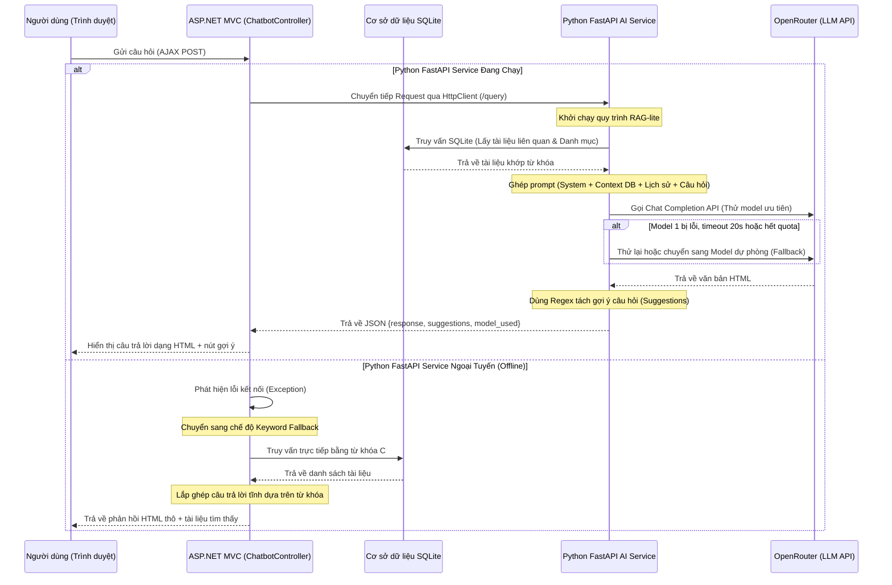
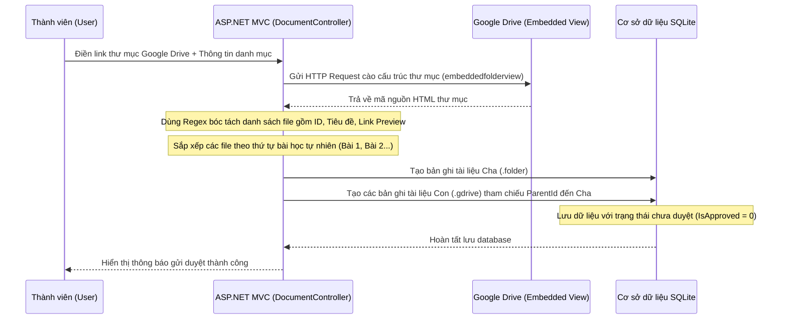

# 📚 HAUDOCSSHARE — Nền tảng Chia sẻ Tài liệu

**HAUDOCSSHARE** là ứng dụng web chia sẻ tài liệu học tập dành cho sinh viên Trường Đại học Kiến trúc Hà Nội. Xây dựng bằng **ASP.NET Core 10 (MVC)** + **SQLite** + **Python FastAPI AI Chatbot**.


---

## 🤖 CÁCH XÂY DỰNG AI CHATBOT — HƯỚNG DẪN CHI TIẾT

### 1. Tổng quan Kiến trúc Chatbot

Chatbot trong HAUDOCSSHARE được xây dựng theo mô hình **RAG-lite (Retrieval-Augmented Generation)** kết hợp với **Multi-layer Fallback** (Cơ chế dự phòng nhiều lớp), gồm hai thành phần chạy song song:

| Thành phần | Công nghệ | Vai trò |
|---|---|---|
| **Web Backend** | ASP.NET Core 10 (C#) | Tiếp nhận yêu cầu từ trình duyệt, điều phối gọi Python AI, xử lý fallback |
| **AI Service** | Python FastAPI + OpenRouter | Thực hiện truy vấn SQLite, xây dựng prompt, gọi LLM trả lời thông minh |

Hai thành phần này giao tiếp với nhau qua giao thức **HTTP/REST** (C# gửi POST đến Python service ở port 8001).

---

### 2. Lý do chọn công nghệ

| Công nghệ | Lý do lựa chọn |
|---|---|
| **Python FastAPI** | Bất đồng bộ (async), tốc độ cao, dễ tích hợp với thư viện AI |
| **OpenRouter AI** | Truy cập miễn phí nhiều LLM (Gemma, LLaMA, Qwen...) qua một API duy nhất |
| **SQLite (RAG-lite)** | Tái sử dụng CSDL sẵn có của web app, cung cấp thông tin tài liệu thực tế cho AI |
| **Keyword Fallback (C#)** | Đảm bảo chatbot vẫn trả lời được ngay cả khi server AI bị tắt hoàn toàn |

---

### 3. Các bước xây dựng chi tiết

#### Bước 1: Thiết kế Giao diện Chat trên Web (Frontend)

Giao diện chat được nhúng trực tiếp vào file `_Layout.cshtml` (layout chung toàn trang), bao gồm:
- Nút chat nổi ở góc màn hình (floating button).
- Cửa sổ chat popup với lịch sử tin nhắn.
- Ô nhập câu hỏi và các nút gợi ý câu hỏi tiếp theo.
- JavaScript gửi yêu cầu AJAX đến `ChatbotController` phía C#, không reload trang.

```javascript
// Gửi câu hỏi qua AJAX
async function sendMessage() {
    const message = chatInput.value.trim();
    if (!message) return;

    appendMessage("user", message);

    // Gửi POST đến ChatbotController với nội dung câu hỏi + lịch sử hội thoại
    const response = await fetch("/Chatbot/Query", {
        method: "POST",
        headers: { "Content-Type": "application/json" },
        body: JSON.stringify({
            message: message,
            history: chatHistory.slice(-6)  // Gửi 6 lượt gần nhất làm context
        })
    });

    const data = await response.json();
    appendMessage("bot", data.response);  // Hiển thị HTML từ AI
    showSuggestions(data.suggestions);    // Hiển thị nút gợi ý
}
```

#### Bước 2: Tạo ChatbotController (C#) — Cổng điều phối trung gian

File `Controllers/ChatbotController.cs` hoạt động như một **Gateway** (cổng trung gian):

```
Trình duyệt  →  ChatbotController (C#)  →  Python FastAPI (AI)
                        ↓ (nếu AI lỗi)
                   KeywordFallback (C#) → Trả kết quả tĩnh
```

Luồng xử lý trong `ChatbotController`:
1. Nhận yêu cầu từ trình duyệt (tin nhắn + lịch sử hội thoại).
2. Gọi `CallPythonAIService()` — gửi HTTP POST đến Python service (timeout 45 giây).
3. Nếu thành công → trả kết quả của AI về cho trình duyệt.
4. Nếu lỗi kết nối → gọi `KeywordFallback()` — phân tích từ khóa thủ công bằng C#.

```csharp
[HttpPost]
public async Task<IActionResult> Query([FromBody] ChatRequest request)
{
    try
    {
        // Ưu tiên: Gọi Python AI Service
        var aiResponse = await CallPythonAIService(request.Message, request.History);
        if (aiResponse != null) return Json(aiResponse);
    }
    catch (Exception ex)
    {
        Console.WriteLine($"Python AI offline: {ex.Message}");
        // Python bị tắt → tự xử lý bằng keyword matching
    }

    // Dự phòng: Keyword Fallback trong C#
    return Json(await KeywordFallback(request.Message));
}
```

#### Bước 3: Xây dựng Python AI Service (FastAPI + OpenRouter)

Đây là trái tim của hệ thống chatbot. Python service thực hiện quy trình **RAG-lite** đầy đủ:

**3.1. Khởi tạo server FastAPI**
```python
app = FastAPI(title="HAUDOCSSHARE AI Chatbot Service")

# Cho phép C# gọi qua HTTP (CORS)
app.add_middleware(CORSMiddleware, allow_origins=["*"])
```

**3.2. Kết nối OpenRouter AI một lần duy nhất khi khởi động**
```python
@asynccontextmanager
async def lifespan(app):
    global ai_client
    # Khởi tạo client OpenRouter một lần, tái sử dụng cho mọi request
    ai_client = AsyncOpenAI(
        base_url="https://openrouter.ai/api/v1",
        api_key=OPENROUTER_API_KEY
    )
    yield  # Server chạy trong đây
```

**3.3. Endpoint /query — Luồng RAG-lite chính**
```python
@app.post("/query")
async def query_chatbot(req: ChatRequest):
    # Bước A: Tìm tài liệu liên quan từ SQLite (RAG)
    docs = search_documents(req.message)          # Truy vấn DB cục bộ
    categories = get_all_categories()             # Lấy danh mục môn học

    # Bước B: Xây dựng prompt đầy đủ
    user_prompt = build_user_prompt(req.message, docs, categories)
    # → Ghép: [Danh mục] + [Tài liệu tìm được] + [Câu hỏi]

    # Bước C: Chuyển đổi lịch sử hội thoại sang format OpenAI
    chat_history = [{"role": h.role, "content": h.content} for h in req.history[-6:]]

    # Bước D: Gọi OpenRouter AI (có retry và fallback model tự động)
    raw_text, model_used = await call_openrouter_with_fallback(
        prompt=user_prompt,
        system=SYSTEM_PROMPT,
        history=chat_history
    )

    # Bước E: Tách gợi ý câu hỏi từ phản hồi của AI
    html_response, suggestions = parse_suggestions_from_response(raw_text)

    # Bước F: Thêm thẻ HTML card tài liệu nếu AI chưa tự render
    if docs and "<div class='chat-doc-list'>" not in html_response:
        html_response += build_html_docs_block(docs)

    return ChatResponse(response=html_response, suggestions=suggestions)
```

#### Bước 4: Xây dựng cơ chế Truy vấn SQLite (db_search.py)

Python service không gọi trực tiếp vào ASP.NET Core để lấy tài liệu, mà **đọc thẳng file SQLite** cùng dữ liệu với web app:

```python
def search_documents(query: str, limit: int = 6) -> list[dict]:
    keyword = f"%{query.lower()}%"
    
    # Chỉ lấy tài liệu đã duyệt, không lấy bài con (playlist)
    sql = """
        SELECT d.Id, d.Title, d.Description, d.Author, d.Tags,
               d.FileExtension, d.DownloadCount, d.ViewCount, c.Name AS CategoryName
        FROM Documents d
        LEFT JOIN Categories c ON d.CategoryId = c.Id
        WHERE d.IsApproved = 1
          AND d.ParentId IS NULL
          AND (LOWER(d.Title) LIKE ? OR LOWER(d.Description) LIKE ?
               OR LOWER(d.Tags) LIKE ? OR LOWER(d.Author) LIKE ?
               OR LOWER(c.Name) LIKE ?)
        ORDER BY d.DownloadCount DESC, d.ViewCount DESC
        LIMIT ?
    """
    # Tài liệu phổ biến nhất (nhiều lượt tải/xem) hiển thị trước
    conn = sqlite3.connect(get_db_path())
    rows = conn.execute(sql, (keyword,)*5 + (limit,)).fetchall()
    return [dict(r) for r in rows]
```

#### Bước 5: Xây dựng Prompt Engineering (prompts.py)

Đây là yếu tố quyết định chất lượng câu trả lời của AI:

**System Prompt** — Định hình vai trò của AI:
```
Bạn là Trợ lý ảo HAUDOCSSHARE.
- Trả lời tiếng Việt 100%
- Định dạng HTML (không dùng Markdown)
- Thân thiện, súc tích < 300 từ
- KHÔNG bịa đặt thông tin tài liệu không có trong database
```

**User Prompt** — Bơm dữ liệu thực tế vào câu hỏi:
```
## Các danh mục tài liệu: Công nghệ thông tin, Kinh tế, Y tế...

## Tài liệu tìm được từ DB:
1. [ID:42] Giáo trình Lập trình C# - PDF - 245 lượt tải
   Link: /Document/Details/42

## Câu hỏi sinh viên:
Cho tôi tài liệu về C#?

→ Kết thúc bằng: <!--SUGGESTIONS-->["gợi ý 1","gợi ý 2","gợi ý 3"]<!--/SUGGESTIONS-->
```

AI đọc context thực từ DB và trả lời đúng, không bịa thông tin.

#### Bước 6: Xây dựng cơ chế Fallback Model tự động (call_openrouter_with_fallback)

Danh sách model được sắp xếp theo độ ưu tiên. Nếu model chính bị lỗi, hệ thống tự chuyển sang model tiếp theo:

```python
MODEL_PRIORITY = [
    "google/gemma-4-31b-it:free",       # Model chính
    "meta-llama/llama-3.3-70b-instruct:free",  # Dự phòng 1
    "qwen/qwen3-coder:free",             # Dự phòng 2
    "meta-llama/llama-3.2-3b-instruct:free",   # Dự phòng 3
]

async def call_openrouter_with_fallback(prompt, system, history):
    for model_name in MODEL_PRIORITY:
        try:
            # Timeout 20 giây mỗi model — tránh nghẽn vô hạn
            resp = await asyncio.wait_for(
                ai_client.chat.completions.create(model=model_name, messages=...),
                timeout=20.0
            )
            return resp.choices[0].message.content, model_name

        except asyncio.TimeoutError:
            continue  # Timeout → thử model tiếp theo

        except Exception as e:
            if "429" in str(e) or "402" in str(e):
                continue  # Hết quota → thử model tiếp theo
            if "404" in str(e):
                continue  # Model không tồn tại → thử tiếp
            raise         # Lỗi khác → dừng
```

#### Bước 7: Triển khai (Deployment)

Chatbot Python được khởi động độc lập bằng `run.bat`:
```bat
cd chatbot_ai
python -m uvicorn main:app --host 0.0.0.0 --port 8001 --reload
```

File `.env` chứa API Key của OpenRouter (không commit lên Git):
```
OPENROUTER_API_KEY=sk-or-v1-xxxxxxxxxxxx
DB_PATH=../documentshare.db
```

---

### 4. Sơ đồ Luồng hoạt động Chatbot

```
Người dùng gõ câu hỏi
        │
        ▼
[Trình duyệt] ──AJAX POST──▶ [ChatbotController C#]
                                      │
                          ┌───────────▼───────────┐
                          │  Python AI Online?     │
                          └───────────┬───────────┘
                            Có ✓      │     Không ✗
                            │         │          │
                            ▼         │          ▼
                   [Python FastAPI]   │   [KeywordFallback C#]
                          │          │          │
                   ┌──────▼──────┐   │   Phân tích từ khóa
                   │ RAG-lite    │   │   thủ công trong C#
                   │ SQLite DB   │   │          │
                   └──────┬──────┘   │          │
                          │          │          │
                   Tài liệu liên quan│          │
                          │          │          │
                   ┌──────▼──────┐   │          │
                   │ Build Prompt│   │          │
                   │ (System +   │   │          │
                   │  Context +  │   │          │
                   │  History +  │   │          │
                   │  Question)  │   │          │
                   └──────┬──────┘   │          │
                          │          │          │
                   ┌──────▼──────┐   │          │
                   │ OpenRouter  │   │          │
                   │ LLM API     │   │          │
                   │ (Fallback   │   │          │
                   │  multi-     │   │          │
                   │  model)     │   │          │
                   └──────┬──────┘   │          │
                          │          │          │
                   HTML Response     │          │
                   + Suggestions     │          │
                          │          │          │
                          └──────────┘──────────┘
                                      │
                                      ▼
                            [Trình duyệt hiển thị]
                            HTML chat + nút gợi ý
```

---

## 🗂️ CẤU TRÚC THƯ MỤC

```
HAUDOCSSHARE/
├── Program.cs                  ← Điểm khởi động ứng dụng
├── Documentshare.csproj        ← File cấu hình dự án .NET
├── appsettings.json            ← Chuỗi kết nối DB, cấu hình app
├── documentshare.db            ← Cơ sở dữ liệu SQLite
│
├── Models/                     ← Các lớp dữ liệu (Entity + ViewModel)
│   ├── Document.cs
│   ├── Category.cs
│   ├── Comment.cs
│   ├── User.cs
│   └── HomeViewModel.cs
│
├── Data/
│   └── AppDbContext.cs         ← EF Core DbContext, cấu hình quan hệ, seed data
│
├── Controllers/                ← Xử lý logic nghiệp vụ
│   ├── HomeController.cs
│   ├── DocumentController.cs
│   ├── AccountController.cs
│   ├── AdminController.cs
│   └── ChatbotController.cs
│
├── Views/                      ← Giao diện Razor (.cshtml)
│   ├── Home/Index.cshtml
│   ├── Document/Browse.cshtml
│   ├── Document/Details.cshtml
│   ├── Document/Upload.cshtml
│   ├── Account/Login.cshtml
│   ├── Account/Register.cshtml
│   ├── Admin/Index.cshtml
│   ├── Admin/Users.cshtml
│   ├── Admin/Documents.cshtml
│   └── Shared/_Layout.cshtml
│
├── wwwroot/                    ← File tĩnh (CSS, JS, hình ảnh, uploads)
│   └── uploads/                ← Thư mục lưu file tài liệu người dùng upload
│
└── chatbot_ai/                 ← Python AI Chatbot Service
    ├── main.py                 ← FastAPI server chính
    ├── db_search.py            ← Truy vấn SQLite
    ├── prompts.py              ← System prompt + build prompt
    ├── requirements.txt        ← Thư viện Python cần cài
    ├── .env                    ← API key OpenRouter
    └── run.bat                 ← Script khởi động chatbot
```

---

## 🔄 LUỒNG HOẠT ĐỘNG HỆ THỐNG (SYSTEM WORKFLOWS)

### 1. Luồng truy vấn Chatbot AI (RAG-lite & Fallback)

Khi người dùng gửi câu hỏi trong khung chat, hệ thống hoạt động theo quy trình tuần tự sau:



### 2. Luồng tải lên và tự động hóa danh sách bài giảng Google Drive (Playlist Import)

Hệ thống hỗ trợ nhập toàn bộ thư mục Google Drive thành một danh sách bài giảng (Playlist):



---

## ⚙️ GIẢI THÍCH CHI TIẾT MÃ NGUỒN CỦA HỆ THỐNG

### 1. File Program.cs — Khởi tạo & Cấu hình dịch vụ ASP.NET Core

`Program.cs` là điểm khởi đầu thiết lập Middleware Pipeline và Service Container (Dependency Injection):

```csharp
using Microsoft.EntityFrameworkCore;
using Documentshare.Data;

var builder = WebApplication.CreateBuilder(args);

builder.Services.AddControllersWithViews();

// ── HttpClient cho Python AI Chatbot Service ──────────────────────────────
builder.Services.AddHttpClient("PythonChatbot", client =>
{
    client.BaseAddress = new Uri("http://localhost:8001");
    client.Timeout     = TimeSpan.FromSeconds(30);
    client.DefaultRequestHeaders.Add("Accept", "application/json");
});

builder.Services.AddDbContext<AppDbContext>(options =>
    options.UseSqlite(builder.Configuration.GetConnectionString("DefaultConnection")));

builder.Services.AddDistributedMemoryCache();
builder.Services.AddSession(options =>
{
    options.IdleTimeout = TimeSpan.FromHours(8);
    options.Cookie.HttpOnly = true;
    options.Cookie.IsEssential = true;
    options.Cookie.Name = "DocumentShare_Session";
});

var app = builder.Build();

using (var scope = app.Services.CreateScope())
{
    var services = scope.ServiceProvider;
    try
    {
        var context = services.GetRequiredService<AppDbContext>();
        context.Database.EnsureCreated();
    }
    catch (Exception ex)
    {
        var logger = services.GetRequiredService<ILogger<Program>>();
        logger.LogError(ex, "Lỗi khi tạo cơ sở dữ liệu.");
    }
}

if (!app.Environment.IsDevelopment())
{
    app.UseExceptionHandler("/Home/Error");
    app.UseHsts();
}

app.UseHttpsRedirection();
app.UseRouting();

app.UseSession();

// Restore session from "Remember Me" cookie if session is null
app.Use(async (context, next) =>
{
    if (context.Session.GetInt32("UserId") == null)
    {
        if (context.Request.Cookies.TryGetValue("DS_RememberUser", out var userIdStr) && int.TryParse(userIdStr, out var userId))
        {
            var dbContext = context.RequestServices.GetRequiredService<AppDbContext>();
            var user = await dbContext.Users.FindAsync(userId);
            if (user != null && user.IsActive)
            {
                context.Session.SetInt32("UserId", user.Id);
                context.Session.SetString("UserName", user.Username);
                context.Session.SetString("UserDisplayName", user.DisplayName);
                context.Session.SetString("UserRole", user.Role);
            }
        }
    }
    await next();
});

app.UseAuthorization();

app.MapStaticAssets();

app.MapControllerRoute(
    name: "default",
    pattern: "{controller=Home}/{action=Index}/{id?}")
    .WithStaticAssets();

app.Run();
```

*   **HttpClient Factory**: Đăng ký Named Client `"PythonChatbot"` với cấu hình Timeout 30 giây để gửi yêu cầu đến dịch vụ Python AI. Việc sử dụng `IHttpClientFactory` giúp tối ưu hóa việc quản lý socket, tránh tình trạng cạn kiệt tài nguyên cổng mạng (socket exhaustion).
*   **Database Setup**: Đăng ký `AppDbContext` sử dụng cơ sở dữ liệu SQLite. Đoạn code `context.Database.EnsureCreated()` giúp tạo mới file CSDL cùng các bảng ngay lần chạy đầu tiên.
*   **Session Management**: Cấu hình Session với cookie `DocumentShare_Session` được đặt thuộc tính `HttpOnly = true` để chống tấn công XSS (JS không thể đọc cookie) và thời gian sống là 8 giờ.
*   **Remember Me Middleware**: Đăng ký một Inline Middleware. Khi người dùng truy cập trang mà Session trống, Middleware này sẽ kiểm tra Cookie `DS_RememberUser`. Nếu có, nó sẽ giải mã lấy ID người dùng và truy vấn CSDL khôi phục lại Session đăng nhập.

---

### 2. File Data/AppDbContext.cs — Quản lý CSDL & Ràng buộc thực thể

Lớp `AppDbContext` kế thừa từ `DbContext` của Entity Framework Core, ánh xạ các Entity thành bảng trong SQLite và thiết lập các khóa ngoại, cấu trúc cascade delete.

```csharp
using System;
using Microsoft.EntityFrameworkCore;
using Documentshare.Models;

namespace Documentshare.Data
{
    public class AppDbContext : DbContext
    {
        public AppDbContext(DbContextOptions<AppDbContext> options) : base(options) { }

        public DbSet<Category> Categories { get; set; }
        public DbSet<Document> Documents { get; set; }
        public DbSet<Comment> Comments { get; set; }
        public DbSet<User> Users { get; set; }

        protected override void OnModelCreating(ModelBuilder modelBuilder)
        {
            base.OnModelCreating(modelBuilder);

            modelBuilder.Entity<Document>()
                .HasOne(d => d.Category)
                .WithMany(c => c.Documents)
                .HasForeignKey(d => d.CategoryId)
                .OnDelete(DeleteBehavior.Cascade);

            modelBuilder.Entity<Document>()
                .HasOne(d => d.Parent)
                .WithMany(p => p.SubDocuments)
                .HasForeignKey(d => d.ParentId)
                .OnDelete(DeleteBehavior.Cascade);

            modelBuilder.Entity<Comment>()
                .HasOne(c => c.Document)
                .WithMany(d => d.Comments)
                .HasForeignKey(c => c.DocumentId)
                .OnDelete(DeleteBehavior.Cascade);

            modelBuilder.Entity<Category>().HasData(
                new Category { Id = 1,  Name = "Công nghệ thông tin",   Description = "Lập trình, phần mềm, mạng máy tính, AI, DevOps",          Icon = "bi-code-slash",        ColorClass = "gradient-blue"    },
                new Category { Id = 2,  Name = "Kinh tế & Kinh doanh",  Description = "Quản trị, tài chính, marketing, kế toán, khởi nghiệp",     Icon = "bi-graph-up-arrow",    ColorClass = "gradient-green"   },
                new Category { Id = 3,  Name = "Khoa học & Kỹ thuật",   Description = "Vật lý, hóa học, sinh học, cơ khí, điện tử, xây dựng",    Icon = "bi-lightbulb",         ColorClass = "gradient-yellow"  },
                new Category { Id = 4,  Name = "Y tế & Sức khỏe",       Description = "Y học, dược, điều dưỡng, dinh dưỡng, sức khỏe tâm thần",  Icon = "bi-heart-pulse",       ColorClass = "gradient-red"     },
                new Category { Id = 5,  Name = "Luật & Pháp lý",        Description = "Luật dân sự, hình sự, thương mại, lao động, hiến pháp",    Icon = "bi-shield-check",      ColorClass = "gradient-purple"  },
                new Category { Id = 6,  Name = "Ngoại ngữ",             Description = "Tiếng Anh, Nhật, Hàn, Trung, Pháp, IELTS, TOEIC",         Icon = "bi-translate",         ColorClass = "gradient-cyan"    },
                new Category { Id = 7,  Name = "Khoa học xã hội",       Description = "Lịch sử, địa lý, xã hội học, tâm lý học, triết học",       Icon = "bi-people",            ColorClass = "gradient-orange"  },
                new Category { Id = 8,  Name = "Nghệ thuật & Thiết kế", Description = "Đồ họa, nhiếp ảnh, âm nhạc, kiến trúc, UX/UI",           Icon = "bi-palette",           ColorClass = "gradient-pink"    },
                new Category { Id = 9,  Name = "Giáo dục phổ thông",    Description = "Tài liệu THPT, THCS, đề thi, ôn tập các môn học",         Icon = "bi-mortarboard",       ColorClass = "gradient-teal"    },
                new Category { Id = 10, Name = "Kỹ năng mềm",           Description = "Giao tiếp, lãnh đạo, quản lý thời gian, tư duy phản biện", Icon = "bi-person-check",      ColorClass = "gradient-emerald" },
                new Category { Id = 11, Name = "Nông nghiệp & Môi trường",Description="Nông lâm ngư nghiệp, bảo vệ môi trường, biến đổi khí hậu", Icon = "bi-tree",              ColorClass = "gradient-lime"    },
                new Category { Id = 12, Name = "Khác",                   Description = "Các tài liệu không thuộc danh mục cụ thể nào",            Icon = "bi-folder2-open",      ColorClass = "gradient-slate"   }
            );

            modelBuilder.Entity<User>().HasData(
                new User
                {
                    Id          = 1,
                    Username    = "admin",
                    DisplayName = "Quản trị viên",
                    Email       = "admin@haudocsshare.local",
                    PasswordHash = "$2a$11$RRwjFuVLhRbHX9bxTKQBpOIm6oHiOhYI3S1pO4fNzI7zGQRJpJEGe",
                    Role        = "Admin",
                    CreatedAt   = new DateTime(2026, 1, 1),
                    IsActive    = true
                }
            );
        }
    }
}
```

*   **Ràng buộc Quan hệ**:
    *   `Document` -> `Category`: Quan hệ 1-N (một Category có nhiều Document). Dùng `DeleteBehavior.Cascade` (khi xóa Category sẽ tự động xóa sạch các Document thuộc Category đó).
    *   `Document` -> `Parent`: Cấu hình quan hệ đệ quy tự tham chiếu (self-referencing). Tài liệu cha có nhiều tài liệu con (`SubDocuments`). Khi tài liệu cha bị xóa, toàn bộ tài liệu con trong playlist Google Drive cũng bị xóa theo.
    *   `Comment` -> `Document`: Một tài liệu có nhiều bình luận. Sử dụng cascade delete để dọn dẹp sạch bình luận cũ khi tài liệu bị gỡ.
*   **Seed dữ liệu**: Tự động chèn 12 Danh mục học tập định sẵn và tài khoản Admin mặc định với mật khẩu đã hash khi khởi tạo CSDL lần đầu.

---

### 3. File AccountController.cs — Đăng ký, Đăng nhập & Mã hóa bảo mật

Xử lý vòng đời đăng nhập, đăng xuất, lưu trữ thông tin đăng nhập và mã hóa mật khẩu người dùng.

```csharp
using System;
using System.Security.Cryptography;
using System.Text;
using System.Threading.Tasks;
using Microsoft.AspNetCore.Http;
using Microsoft.AspNetCore.Mvc;
using Microsoft.EntityFrameworkCore;
using Documentshare.Data;
using Documentshare.Models;

namespace Documentshare.Controllers
{
    public class AccountController : Controller
    {
        private readonly AppDbContext _ctx;

        public AccountController(AppDbContext ctx)
        {
            _ctx = ctx;
        }

        [HttpGet]
        public IActionResult Register()
        {
            if (GetCurrentUser() != null) return RedirectToAction("Index", "Home");
            return View();
        }

        [HttpPost, ValidateAntiForgeryToken]
        public async Task<IActionResult> Register(RegisterViewModel vm)
        {
            if (!ModelState.IsValid) return View(vm);

            var exists = await _ctx.Users
                .AnyAsync(u => u.Username == vm.Username || u.Email == vm.Email);
            if (exists)
            {
                ModelState.AddModelError("", "Tên đăng nhập hoặc email đã được sử dụng.");
                return View(vm);
            }

            var user = new User
            {
                Username     = vm.Username.Trim(),
                DisplayName  = vm.DisplayName.Trim(),
                Email        = vm.Email.Trim().ToLower(),
                PasswordHash = HashPassword(vm.Password),
                Role         = "User",
                CreatedAt    = DateTime.Now,
                IsActive     = true
            };
            _ctx.Users.Add(user);
            await _ctx.SaveChangesAsync();

            SetSessionUser(user);
            TempData["SuccessMessage"] = $"Chào mừng {user.DisplayName}! Tài khoản đã được tạo thành công.";
            return RedirectToAction("Index", "Home");
        }

        [HttpGet]
        public IActionResult Login(string? returnUrl)
        {
            if (GetCurrentUser() != null) return RedirectToAction("Index", "Home");
            ViewBag.ReturnUrl = returnUrl;
            return View();
        }

        [HttpPost, ValidateAntiForgeryToken]
        public async Task<IActionResult> Login(LoginViewModel vm, string? returnUrl)
        {
            if (!ModelState.IsValid) return View(vm);

            var input = vm.UsernameOrEmail.Trim().ToLower();
            var user = await _ctx.Users.FirstOrDefaultAsync(u =>
                (u.Username.ToLower() == input || u.Email == input) && u.IsActive);

            if (user == null || !VerifyPassword(vm.Password, user.PasswordHash))
            {
                ModelState.AddModelError("", "Tên đăng nhập/email hoặc mật khẩu không đúng.");
                return View(vm);
            }

            SetSessionUser(user, vm.RememberMe);
            TempData["SuccessMessage"] = $"Đăng nhập thành công! Chào {user.DisplayName}.";

            if (!string.IsNullOrEmpty(returnUrl) && Url.IsLocalUrl(returnUrl))
                return Redirect(returnUrl);

            return user.Role == "Admin"
                ? RedirectToAction("Index", "Admin")
                : RedirectToAction("Index", "Home");
        }

        [HttpPost, ValidateAntiForgeryToken]
        public IActionResult Logout()
        {
            HttpContext.Session.Clear();
            Response.Cookies.Delete("DocumentShare_Session");
            Response.Cookies.Delete("DocumentShare_Role");
            Response.Cookies.Delete("DS_RememberUser");
            TempData["SuccessMessage"] = "Bạn đã đăng xuất thành công.";
            return RedirectToAction("Index", "Home");
        }

        [HttpGet]
        public IActionResult Profile()
        {
            var user = GetCurrentUser();
            if (user == null) return RedirectToAction("Login");
            return View(user);
        }

        private static string HashPassword(string password)
        {
            var salt = Guid.NewGuid().ToString("N")[..8];
            var hash = ComputeSha256($"{salt}:{password}");
            return $"sha256:{salt}:{hash}";
        }

        private static bool VerifyPassword(string password, string stored)
        {
            if (stored.StartsWith("$2a$") || stored.StartsWith("$2b$"))
                return password == "admin123" && stored.StartsWith("$2a$");

            if (stored.StartsWith("sha256:"))
            {
                var parts = stored.Split(':');
                if (parts.Length != 3) return false;
                var expectedHash = ComputeSha256($"{parts[1]}:{password}");
                return parts[2] == expectedHash;
            }
            return false;
        }

        private static string ComputeSha256(string input)
        {
            var bytes = SHA256.HashData(Encoding.UTF8.GetBytes(input));
            return Convert.ToHexString(bytes).ToLower();
        }

        private void SetSessionUser(User user, bool remember = false)
        {
            HttpContext.Session.SetInt32("UserId", user.Id);
            HttpContext.Session.SetString("UserName", user.Username);
            HttpContext.Session.SetString("UserDisplayName", user.DisplayName);
            HttpContext.Session.SetString("UserRole", user.Role);

            if (remember)
            {
                var opts = new CookieOptions
                {
                    Expires     = DateTimeOffset.UtcNow.AddDays(30),
                    HttpOnly    = true,
                    IsEssential = true
                };
                Response.Cookies.Append("DS_RememberUser", user.Id.ToString(), opts);
            }
        }

        private User? GetCurrentUser()
        {
            var id = HttpContext.Session.GetInt32("UserId");
            if (id == null) return null;
            return _ctx.Users.Find(id.Value);
        }
    }
}
```

*   **Cơ chế mã hóa mật khẩu**:
    *   Hàm `HashPassword` sinh ngẫu nhiên một chuỗi `salt` dài 8 ký tự bằng UUID.
    *   Hàm sau đó băm chuỗi `${salt}:${password}` bằng thuật toán **SHA-256** và lưu dưới định dạng `sha256:salt:hash`. Chuỗi salt này ngăn chặn việc dò mật khẩu qua các bảng băm có sẵn (Rainbow Tables).
*   **Xác minh mật khẩu**: Hàm hỗ trợ so khớp cả cơ chế băm cũ của Admin gốc (Bcrypt - bắt đầu bằng `$2a$`) lẫn cơ chế SHA-256 mới để đảm bảo tính tương thích ngược của hệ thống.
*   **Xử lý CSRF**: Các action sửa đổi dữ liệu (POST) đều được trang bị tag `[ValidateAntiForgeryToken]` để chặn đứng hoàn toàn lỗ hổng Cross-Site Request Forgery.

---

### 4. File HomeController.cs — Trang chủ & Tìm kiếm đa thuộc tính

Quản lý trang giao diện chính, thực hiện tìm kiếm, phân loại và sắp xếp tài liệu.

```csharp
using System;
using System.Diagnostics;
using System.Linq;
using System.Threading.Tasks;
using Microsoft.AspNetCore.Mvc;
using Microsoft.EntityFrameworkCore;
using Microsoft.Extensions.Logging;
using Documentshare.Data;
using Documentshare.Models;

namespace Documentshare.Controllers
{
    public class HomeController : Controller
    {
        private readonly AppDbContext _context;
        private readonly ILogger<HomeController> _logger;

        public HomeController(AppDbContext context, ILogger<HomeController> logger)
        {
            _context = context;
            _logger = logger;
        }

        public async Task<IActionResult> Index(string? q, int? categoryId, string? level, string? ext, string? lang, string sort = "newest")
        {
            var categories = await _context.Categories.ToListAsync();
            var allApproved = _context.Documents.Where(d => d.IsApproved);
            var approvedQ   = allApproved.Where(d => d.ParentId == null);

            var vm = new HomeViewModel
            {
                Categories      = categories,
                TotalDocuments  = await approvedQ.CountAsync(),
                TotalDownloads  = await allApproved.SumAsync(d => (int?)d.DownloadCount) ?? 0,
                TotalViews      = await allApproved.SumAsync(d => (int?)d.ViewCount)     ?? 0,
                TotalCategories = categories.Count,
                SearchString    = q     ?? string.Empty,
                SelectedCategoryId = categoryId,
                SelectedLevel   = level ?? string.Empty,
                SelectedExtension = ext ?? string.Empty,
                SelectedLanguage  = lang ?? string.Empty,
                SortBy          = sort,
                FeaturedDocuments = await approvedQ
                    .Include(d => d.Category)
                    .OrderByDescending(d => d.DownloadCount)
                    .Take(3).ToListAsync()
            };

            // Build main document query
            var query = _context.Documents
                .Include(d => d.Category)
                .Include(d => d.Comments)
                .Where(d => d.IsApproved && d.ParentId == null);

            if (!string.IsNullOrWhiteSpace(q))
            {
                var ql = q.ToLower();
                query = query.Where(d =>
                    d.Title.ToLower().Contains(ql) ||
                    d.Description.ToLower().Contains(ql) ||
                    d.Tags.ToLower().Contains(ql) ||
                    d.Author.ToLower().Contains(ql));
            }
            if (categoryId.HasValue && categoryId.Value > 0)
                query = query.Where(d => d.CategoryId == categoryId.Value);
            if (!string.IsNullOrEmpty(level))
                query = query.Where(d => d.Level == level);
            if (!string.IsNullOrEmpty(ext))
                query = query.Where(d => d.FileExtension.ToLower() == ext.ToLower());
            if (!string.IsNullOrEmpty(lang))
                query = query.Where(d => d.Language == lang);

            query = sort switch
            {
                "downloads" => query.OrderByDescending(d => d.DownloadCount),
                "views"     => query.OrderByDescending(d => d.ViewCount),
                "oldest"    => query.OrderBy(d => d.UploadDate),
                _           => query.OrderByDescending(d => d.UploadDate)
            };

            vm.Documents = await query.ToListAsync();
            return View(vm);
        }

        public IActionResult Privacy() => View();

        [ResponseCache(Duration = 0, Location = ResponseCacheLocation.None, NoStore = true)]
        public IActionResult Error() =>
            View(new ErrorViewModel { RequestId = Activity.Current?.Id ?? HttpContext.TraceIdentifier });
    }
}
```

*   **Truy vấn tối ưu**: Sử dụng `Where(d => d.ParentId == null)` để chỉ lấy các tài liệu cha chính ở ngoài trang chủ, ẩn các tệp con thuộc danh sách bài giảng học tập để tránh tràn danh sách hiển thị.
*   **Thống kê thời gian thực**: Gom tổng lượng tải xuống và xem bằng hàm `.SumAsync(...)` ngay trên cơ sở dữ liệu để giảm dung lượng mạng truyền tải về ứng dụng.
*   **Tìm kiếm & Lọc nhiều tiêu chí**: Sử dụng LINQ với cơ chế Deferred Execution (Trì hoãn thực thi). Các hàm lọc `.Where()` chỉ thêm cấu trúc SQL điều kiện vào biến `query` và chỉ thực sự truy vấn xuống SQLite bằng hàm `ToListAsync()` ở dòng cuối cùng.

---

### 5. File DocumentController.cs — Tải lên, Tải xuống & Thu thập dữ liệu Google Drive

Chứa các chức năng nghiệp vụ quan trọng nhất: Duyệt xem, tải file, bình luận và cào dữ liệu tự động từ các liên kết Drive.

```csharp
using System;
using System.IO;
using System.Linq;
using System.Threading.Tasks;
using Microsoft.AspNetCore.Hosting;
using Microsoft.AspNetCore.Http;
using Microsoft.AspNetCore.Mvc;
using Microsoft.AspNetCore.StaticFiles;
using Microsoft.EntityFrameworkCore;
using Documentshare.Data;
using Documentshare.Models;

namespace Documentshare.Controllers
{
    public class DocumentController : Controller
    {
        private readonly AppDbContext _context;
        private readonly IWebHostEnvironment _env;

        public DocumentController(AppDbContext context, IWebHostEnvironment env)
        {
            _context = context;
            _env = env;
        }

        // Browse all documents (separate full-list page)
        public async Task<IActionResult> Browse(string? q, int? categoryId, string? level, string? ext, string sort = "newest")
        {
            var categories = await _context.Categories.ToListAsync();

            var query = _context.Documents
                .Include(d => d.Category)
                .Include(d => d.Comments)
                .Where(d => d.IsApproved);

            if (!string.IsNullOrWhiteSpace(q))
            {
                var ql = q.ToLower();
                query = query.Where(d =>
                    d.Title.ToLower().Contains(ql) ||
                    d.Description.ToLower().Contains(ql) ||
                    d.Tags.ToLower().Contains(ql) ||
                    d.Author.ToLower().Contains(ql));
            }
            if (categoryId.HasValue && categoryId.Value > 0)
                query = query.Where(d => d.CategoryId == categoryId.Value);
            if (!string.IsNullOrEmpty(level))
                query = query.Where(d => d.Level == level);
            if (!string.IsNullOrEmpty(ext))
                query = query.Where(d => d.FileExtension.ToLower() == ext.ToLower());

            query = sort switch
            {
                "downloads" => query.OrderByDescending(d => d.DownloadCount),
                "views"     => query.OrderByDescending(d => d.ViewCount),
                "oldest"    => query.OrderBy(d => d.UploadDate),
                _           => query.OrderByDescending(d => d.UploadDate)
            };

            ViewBag.Documents  = await query.ToListAsync();
            ViewBag.Categories = categories;
            ViewBag.Q          = q;
            ViewBag.CategoryId = categoryId;
            ViewBag.Level      = level;
            ViewBag.Ext        = ext;
            ViewBag.Sort       = sort;
            return View();
        }

        // Document details
        public async Task<IActionResult> Details(int id, int? subId)
        {
            var doc = await _context.Documents
                .Include(d => d.Category)
                .Include(d => d.Comments)
                .Include(d => d.SubDocuments)
                .FirstOrDefaultAsync(d => d.Id == id);

            if (doc == null) return NotFound();

            // If this is a child document, redirect to its parent page and play this child
            if (doc.ParentId.HasValue)
            {
                return RedirectToAction(nameof(Details), new { id = doc.ParentId.Value, subId = doc.Id });
            }

            // Only increment view for approved docs
            if (doc.IsApproved)
            {
                doc.ViewCount++;
                await _context.SaveChangesAsync();
            }

            // Order subdocuments chronologically (by upload date)
            if (doc.SubDocuments != null && doc.SubDocuments.Count > 0)
            {
                doc.SubDocuments = doc.SubDocuments.OrderBy(d => d.UploadDate).ToList();
                
                // If a subId is specified, make sure it belongs to this parent
                var activeSub = doc.SubDocuments.FirstOrDefault(s => s.Id == subId);
                if (activeSub == null)
                {
                    activeSub = doc.SubDocuments.First();
                }
                ViewBag.ActiveSubDocument = activeSub;
            }

            doc.Comments = doc.Comments.OrderByDescending(c => c.CreatedDate).ToList();
            return View(doc);
        }

        // Download file
        public async Task<IActionResult> Download(int id)
        {
            // Chỉ cho phép người dùng đã đăng nhập tải tài liệu
            var userId = HttpContext.Session.GetInt32("UserId");
            if (userId == null)
            {
                TempData["ErrorMessage"] = "Vui lòng đăng nhập để tải tài liệu.";
                return RedirectToAction("Login", "Account", new { returnUrl = Url.Action("Details", "Document", new { id }) });
            }

            var doc = await _context.Documents.FindAsync(id);
            if (doc == null) return NotFound();

            var path = Path.Combine(_env.WebRootPath, doc.FilePath.TrimStart('/').Replace('/', Path.DirectorySeparatorChar));
            if (!System.IO.File.Exists(path))
                return NotFound("File không tồn tại trên máy chủ.");

            doc.DownloadCount++;
            await _context.SaveChangesAsync();

            var provider = new FileExtensionContentTypeProvider();
            if (!provider.TryGetContentType(path, out var ct)) ct = "application/octet-stream";

            var bytes = await System.IO.File.ReadAllBytesAsync(path);
            return File(bytes, ct, doc.OriginalFileName);
        }

        // Upload form (GET)
        [HttpGet]
        public async Task<IActionResult> Upload()
        {
            var userId = HttpContext.Session.GetInt32("UserId");
            if (userId == null)
            {
                TempData["ErrorMessage"] = "Vui lòng đăng nhập để thực hiện tải lên tài liệu.";
                return RedirectToAction("Login", "Account", new { returnUrl = Url.Action("Upload", "Document") });
            }

            ViewBag.Categories = await _context.Categories.OrderBy(c => c.Name).ToListAsync();
            ViewBag.UploadType = "file";

            var userDisplayName = HttpContext.Session.GetString("UserDisplayName");
            var model = new Document
            {
                Author = userDisplayName ?? "Ẩn danh"
            };
            return View(model);
        }

        private string? ConvertGoogleDriveLinkToEmbed(string url)
        {
            if (string.IsNullOrWhiteSpace(url)) return null;
            url = url.Trim();

            // Handle standard /file/d/FILE_ID/view
            if (url.Contains("/file/d/"))
            {
                try
                {
                    var startIndex = url.IndexOf("/file/d/") + "/file/d/".Length;
                    var endIndex = url.IndexOf("/", startIndex);
                    if (endIndex == -1) endIndex = url.IndexOf("?", startIndex);
                    if (endIndex == -1) endIndex = url.Length;
                    
                    var fileId = url.Substring(startIndex, endIndex - startIndex);
                    if (!string.IsNullOrEmpty(fileId))
                    {
                        return $"https://drive.google.com/file/d/{fileId}/preview";
                    }
                }
                catch { }
            }

            // Handle ?id=FILE_ID
            if (url.Contains("id="))
            {
                try
                {
                    var match = System.Text.RegularExpressions.Regex.Match(url, @"[?&]id=([^&]+)");
                    if (match.Success)
                    {
                        return $"https://drive.google.com/file/d/{match.Groups[1].Value}/preview";
                    }
                }
                catch { }
            }

            // If it is already an embed preview link
            if (url.Contains("/file/d/") && url.Contains("/preview"))
            {
                return url;
            }

            return null;
        }

        private string? ExtractGoogleDriveFolderId(string url)
        {
            if (string.IsNullOrWhiteSpace(url)) return null;
            url = url.Trim();

            if (url.Contains("/folders/"))
            {
                try
                {
                    var startIndex = url.IndexOf("/folders/") + "/folders/".Length;
                    var endIndex = url.IndexOf("/", startIndex);
                    if (endIndex == -1) endIndex = url.IndexOf("?", startIndex);
                    if (endIndex == -1) endIndex = url.Length;
                    return url.Substring(startIndex, endIndex - startIndex);
                }
                catch { }
            }

            if (url.Contains("id=") && (url.Contains("folder") || url.Contains("open")))
            {
                try
                {
                    var match = System.Text.RegularExpressions.Regex.Match(url, @"[?&]id=([^&]+)");
                    if (match.Success)
                    {
                        return match.Groups[1].Value;
                    }
                }
                catch { }
            }

            return null;
        }

        private async Task<List<(string Id, string Title, string PreviewUrl)>> FetchGoogleDriveFolderFiles(string folderId, string? resourceKey)
        {
            var files = new List<(string Id, string Title, string PreviewUrl)>();
            var url = $"https://drive.google.com/embeddedfolderview?id={folderId}";
            if (!string.IsNullOrEmpty(resourceKey))
            {
                url += $"&resourcekey={resourceKey}";
            }

            using (var client = new System.Net.Http.HttpClient())
            {
                client.DefaultRequestHeaders.Add("User-Agent", "Mozilla/5.0 (Windows NT 10.0; Win64; x64) AppleWebKit/537.36 (KHTML, like Gecko) Chrome/120.0.0.0 Safari/537.36");
                try
                {
                    var html = await client.GetStringAsync(url);
                    
                    var entryRegex = new System.Text.RegularExpressions.Regex(
                        @"class=""flip-entry""[^>]*id=""entry-(?<id>[a-zA-Z0-9_-]+)"".*?<a[^>]*href=""(?<href>[^""]+)""[^>]*>.*?class=""flip-entry-title""[^>]*>(?<title>[^<]+)</div>",
                        System.Text.RegularExpressions.RegexOptions.IgnoreCase | System.Text.RegularExpressions.RegexOptions.Singleline);
                        
                    var matches = entryRegex.Matches(html);
                    foreach (System.Text.RegularExpressions.Match m in matches)
                    {
                        var fileId = m.Groups["id"].Value;
                        var rawHref = m.Groups["href"].Value;
                        var rawTitle = m.Groups["title"].Value;

                        var href = System.Net.WebUtility.HtmlDecode(rawHref);
                        var cleanTitle = System.Net.WebUtility.HtmlDecode(rawTitle);

                        // Clean title from "Shared", "Video", etc. suffix
                        cleanTitle = System.Text.RegularExpressions.Regex.Replace(cleanTitle, @"\s+(Video|Shared|Document|PDF|Folder|Image|Audio|Archive)(\s+Shared)*$", "", System.Text.RegularExpressions.RegexOptions.IgnoreCase);
                        cleanTitle = System.Text.RegularExpressions.Regex.Replace(cleanTitle, @"\s+Shared$", "", System.Text.RegularExpressions.RegexOptions.IgnoreCase);

                        // Extract resourcekey from file link
                        var fileResourceKey = "";
                        var fileResMatch = System.Text.RegularExpressions.Regex.Match(href, @"[?&]resourcekey=([^&]+)");
                        if (fileResMatch.Success)
                        {
                            fileResourceKey = fileResMatch.Groups[1].Value;
                        }

                        var previewUrl = $"https://drive.google.com/file/d/{fileId}/preview";
                        if (!string.IsNullOrEmpty(fileResourceKey))
                        {
                            previewUrl += $"?resourcekey={fileResourceKey}";
                        }

                        if (!files.Any(f => f.Id == fileId))
                        {
                            files.Add((fileId, cleanTitle, previewUrl));
                        }
                    }
                }
                catch (Exception ex)
                {
                    Console.WriteLine($"Lỗi khi cào thư mục Google Drive: {ex.Message}");
                }
            }
            
            return files;
        }

        private static int ExtractLessonNumber(string title)
        {
            var match = System.Text.RegularExpressions.Regex.Match(title, @"(?:Bài|Bai|Lesson|Lesson\s+)\s*(?<num>\d+)", System.Text.RegularExpressions.RegexOptions.IgnoreCase);
            if (match.Success && int.TryParse(match.Groups["num"].Value, out var num))
            {
                return num;
            }
            return 999999;
        }

        // Upload form (POST)
        [HttpPost]
        [ValidateAntiForgeryToken]
        public async Task<IActionResult> Upload(Document model, IFormFile? file, string? uploadType, string? driveLink)
        {
            var userId = HttpContext.Session.GetInt32("UserId");
            if (userId == null)
            {
                TempData["ErrorMessage"] = "Vui lòng đăng nhập để thực hiện tải lên tài liệu.";
                return RedirectToAction("Login", "Account", new { returnUrl = Url.Action("Upload", "Document") });
            }

            // Remove server-generated fields from model validation
            ModelState.Remove(nameof(model.FilePath));
            ModelState.Remove(nameof(model.OriginalFileName));
            ModelState.Remove(nameof(model.FileExtension));
            ModelState.Remove(nameof(model.FileSize));

            bool isFolderImport = false;
            string? folderId = null;
            string? folderResourceKey = null;

            if (uploadType == "link" && !string.IsNullOrWhiteSpace(driveLink))
            {
                folderId = ExtractGoogleDriveFolderId(driveLink);
                if (folderId != null)
                {
                    isFolderImport = true;

                    // Extract resourcekey from the driveLink
                    var resKeyMatch = System.Text.RegularExpressions.Regex.Match(driveLink, @"[?&]resourcekey=([^&]+)");
                    if (resKeyMatch.Success)
                    {
                        folderResourceKey = resKeyMatch.Groups[1].Value;
                    }
                }
            }

            if (uploadType == "link")
            {
                if (string.IsNullOrWhiteSpace(driveLink))
                {
                    ModelState.AddModelError("driveLink", "Vui lòng nhập đường dẫn video hoặc thư mục Google Drive.");
                }
                else if (!isFolderImport)
                {
                    var embedUrl = ConvertGoogleDriveLinkToEmbed(driveLink);
                    if (string.IsNullOrEmpty(embedUrl))
                    {
                        ModelState.AddModelError("driveLink", "Đường dẫn Google Drive không hợp lệ. Vui lòng nhập link dạng: https://drive.google.com/file/d/FILE_ID/view");
                    }
                    else
                    {
                        model.FilePath = embedUrl;
                        model.OriginalFileName = "Google Drive Video";
                        model.FileExtension = ".gdrive";
                        model.FileSize = 0;
                    }
                }
            }

            if (!ModelState.IsValid)
            {
                ViewBag.Categories = await _context.Categories.OrderBy(c => c.Name).ToListAsync();
                ViewBag.UploadType = uploadType;
                ViewBag.DriveLink = driveLink;
                return View(model);
            }

            try
            {
                if (isFolderImport && folderId != null)
                {
                    // 1. Create Parent Document first
                    var parentDoc = new Document
                    {
                        Title = model.Title,
                        Description = model.Description ?? $"Thư mục tài liệu liên kết từ Google Drive: {model.Title}.",
                        CategoryId = model.CategoryId,
                        Level = model.Level,
                        Author = string.IsNullOrWhiteSpace(model.Author) ? "Ẩn danh" : model.Author.Trim(),
                        Language = model.Language,
                        Source = string.IsNullOrWhiteSpace(model.Source) ? "" : model.Source.Trim(),
                        Tags = string.IsNullOrWhiteSpace(model.Tags) ? "" : model.Tags.Trim(),
                        FilePath = driveLink,
                        OriginalFileName = "Google Drive Folder",
                        FileExtension = ".folder",
                        FileSize = 0,
                        UploadDate = DateTime.Now,
                        IsApproved = false
                    };
                    _context.Add(parentDoc);
                    await _context.SaveChangesAsync(); // Generates parentDoc.Id

                    // 2. Fetch files from folder using embeddedfolderview
                    var files = await FetchGoogleDriveFolderFiles(folderId, folderResourceKey);
                    if (files.Count == 0)
                    {
                        // Clean up parent doc if empty
                        _context.Remove(parentDoc);
                        await _context.SaveChangesAsync();

                        ModelState.AddModelError("driveLink", "Không tìm thấy tệp nào trong thư mục Google Drive này hoặc thư mục không công khai.");
                        ViewBag.Categories = await _context.Categories.OrderBy(c => c.Name).ToListAsync();
                        ViewBag.UploadType = uploadType;
                        ViewBag.DriveLink = driveLink;
                        return View(model);
                    }

                    // Sort naturally based on lesson number
                    files = files.OrderBy(f => ExtractLessonNumber(f.Title)).ThenBy(f => f.Title).ToList();

                    var now = DateTime.Now;
                    int seq = 0;
                    foreach (var fileInfo in files)
                    {
                        var childDoc = new Document
                        {
                            Title = fileInfo.Title,
                            Description = $"Mục thứ {seq + 1} trong thư mục Google Drive: {fileInfo.Title}.",
                            CategoryId = model.CategoryId,
                            Level = model.Level,
                            Author = parentDoc.Author,
                            Language = model.Language,
                            Source = parentDoc.Source,
                            Tags = parentDoc.Tags,
                            FilePath = fileInfo.PreviewUrl,
                            OriginalFileName = "Google Drive Video",
                            FileExtension = ".gdrive",
                            FileSize = 0,
                            UploadDate = now.AddSeconds(seq + 1),
                            IsApproved = false,
                            ParentId = parentDoc.Id // Link to parent
                        };
                        _context.Add(childDoc);
                        seq++;
                    }

                    await _context.SaveChangesAsync();
                    TempData["SuccessMessage"] = $"Đã tự động thêm {seq} bài học từ thư mục Google Drive vào hệ thống. Đang chờ Admin phê duyệt.";
                    return RedirectToAction("Index", "Home");
                }

                var uploadsDir = Path.Combine(_env.WebRootPath, "uploads");
                Directory.CreateDirectory(uploadsDir);

                if (uploadType != "link")
                {
                    if (file != null && file.Length > 0)
                    {
                        var ext  = Path.GetExtension(file.FileName).ToLowerInvariant();
                        var name = Guid.NewGuid().ToString("N") + ext;
                        var dest = Path.Combine(uploadsDir, name);
                        await using var fs = new FileStream(dest, FileMode.Create);
                        await file.CopyToAsync(fs);

                        model.FilePath        = "/uploads/" + name;
                        model.OriginalFileName = file.FileName;
                        model.FileSize        = file.Length;
                        model.FileExtension   = ext;
                    }
                    else
                    {
                        // No file selected — create a placeholder text file
                        var name = Guid.NewGuid().ToString("N") + ".txt";
                        var dest = Path.Combine(uploadsDir, name);
                        await System.IO.File.WriteAllTextAsync(dest,
                            $"Tài liệu: {model.Title}\nTác giả: {model.Author}\nMô tả: {model.Description}");
                        model.FilePath        = "/uploads/" + name;
                        model.OriginalFileName = model.Title + ".txt";
                        model.FileSize        = 512;
                        model.FileExtension   = ".txt";
                    }
                }

                model.UploadDate = DateTime.Now;
                model.IsApproved = false;
                _context.Add(model);
                await _context.SaveChangesAsync();

                TempData["SuccessMessage"] = "Tài liệu đã được gửi lên thành công và đang chờ Admin phê duyệt.";
                return RedirectToAction("Index", "Home");
            }
            catch (Exception ex)
            {
                ModelState.AddModelError(string.Empty, "Lỗi khi lưu tệp: " + ex.Message);
                ViewBag.Categories = await _context.Categories.OrderBy(c => c.Name).ToListAsync();
                ViewBag.UploadType = uploadType;
                ViewBag.DriveLink = driveLink;
                return View(model);
            }
        }

        // Add comment (AJAX POST)
        [HttpPost]
        public async Task<IActionResult> AddComment(int documentId, string author, string content, int rating)
        {
            var userId = HttpContext.Session.GetInt32("UserId");
            if (userId == null)
            {
                return Json(new { success = false, message = "Vui lòng đăng nhập để đánh giá tài liệu." });
            }

            var userDisplayName = HttpContext.Session.GetString("UserDisplayName");
            var commentAuthor = !string.IsNullOrWhiteSpace(userDisplayName) ? userDisplayName : author;

            if (string.IsNullOrWhiteSpace(commentAuthor) || string.IsNullOrWhiteSpace(content))
                return Json(new { success = false, message = "Vui lòng nhập đầy đủ thông tin." });

            var doc = await _context.Documents.FindAsync(documentId);
            if (doc == null) return Json(new { success = false, message = "Không tìm thấy tài liệu." });

            var comment = new Comment
            {
                DocumentId  = documentId,
                Author      = commentAuthor.Trim(),
                Content     = content.Trim(),
                Rating      = Math.Clamp(rating, 1, 5),
                CreatedDate = DateTime.Now
            };
            _context.Comments.Add(comment);
            await _context.SaveChangesAsync();

            return Json(new {
                success = true,
                author  = comment.Author,
                content = comment.Content,
                rating  = comment.Rating,
                date    = comment.CreatedDate.ToString("dd/MM/yyyy HH:mm")
            });
        }
    }
}
```

*   **Tải lên từ thư mục Google Drive (Playlist Import)**:
    1.  Ứng dụng phân tích link Drive bằng Regex để tách `folderId`.
    2.  Hàm `FetchGoogleDriveFolderFiles` sử dụng `HttpClient` gửi request giả lập User-Agent tới link embed thư mục Drive công khai của Google (`https://drive.google.com/embeddedfolderview?id={folderId}`).
    3.  Ứng dụng dùng regex bóc tách mã HTML trả về để lấy tên file học tập, ID file và chuỗi `resourcekey` (nếu có).
    4.  Hàm `ExtractLessonNumber` dùng regex tìm kiếm các mẫu ký tự `"Bài X"`, `"Lesson X"`, tự động lấy ra số thứ tự của bài học và sắp xếp tăng dần một cách chính xác trước khi lưu vào CSDL.
    5.  Hệ thống tạo ra một tài liệu cha có định dạng `.folder` và nhiều tài liệu con định dạng `.gdrive` được liên kết bằng trường `ParentId`.
*   **Chi tiết tài liệu & Bài học con (Playlist)**: Trong hàm `Details`, nếu người dùng truy cập một tài liệu con, hệ thống sẽ tự động chuyển hướng (`RedirectToAction`) về trang thông tin của tài liệu Cha, đồng thời truyền tham số `subId` để kích hoạt giao diện trình phát nội dung (iframe nhúng Drive) của tài liệu con đó.
*   **Tải xuống an toàn**: Phương thức `Download` bắt buộc người dùng đăng nhập bằng cách kiểm tra Session `UserId`. Nếu chưa có, ứng dụng sẽ chuyển hướng tới trang đăng nhập đồng thời giữ lại liên kết trang trước qua tham số `returnUrl`. Dịch vụ dùng `FileExtensionContentTypeProvider` để phát hiện đuôi file tự động (ví dụ `.pdf` -> `application/pdf`) nhằm giúp trình duyệt tải file đúng định dạng thay vì file thô.

---

### 6. File AdminController.cs — Phân quyền & Quản trị hệ thống

Chứa các chức năng kiểm duyệt bài viết, kiểm soát hoạt động của thành viên và cung cấp số liệu thống kê.

```csharp
using System;
using System.IO;
using System.Threading.Tasks;
using Microsoft.AspNetCore.Hosting;
using Microsoft.AspNetCore.Http;
using Microsoft.AspNetCore.Mvc;
using Microsoft.EntityFrameworkCore;
using Documentshare.Data;
using Documentshare.Models;

namespace Documentshare.Controllers
{
    public class AdminController : Controller
    {
        private readonly AppDbContext _ctx;
        private readonly IWebHostEnvironment _env;

        public AdminController(AppDbContext ctx, IWebHostEnvironment env)
        {
            _ctx = ctx;
            _env = env;
        }

        private bool IsAdmin()
        {
            var role = HttpContext.Session.GetString("UserRole");
            return role == "Admin";
        }

        private IActionResult RedirectIfNotAdmin()
        {
            TempData["ErrorMessage"] = "Bạn không có quyền truy cập khu vực quản trị.";
            return RedirectToAction("Login", "Account");
        }

        public async Task<IActionResult> Index()
        {
            if (!IsAdmin()) return RedirectIfNotAdmin();

            var pending        = await _ctx.Documents.Include(d => d.Category).Where(d => !d.IsApproved && d.ParentId == null).OrderByDescending(d => d.UploadDate).ToListAsync();
            var totalDocs      = await _ctx.Documents.CountAsync(d => d.ParentId == null);
            var totalApproved  = await _ctx.Documents.CountAsync(d => d.IsApproved && d.ParentId == null);
            var totalUsers     = await _ctx.Users.CountAsync();
            var totalAdmins    = await _ctx.Users.CountAsync(u => u.Role == "Admin");
            var totalDownloads = await _ctx.Documents.SumAsync(d => (int?)d.DownloadCount) ?? 0;
            var totalViews     = await _ctx.Documents.SumAsync(d => (int?)d.ViewCount) ?? 0;

            ViewBag.TotalDocs      = totalDocs;
            ViewBag.TotalApproved  = totalApproved;
            ViewBag.TotalPending   = pending.Count;
            ViewBag.TotalUsers     = totalUsers;
            ViewBag.TotalAdmins    = totalAdmins;
            ViewBag.TotalDownloads = totalDownloads;
            ViewBag.TotalViews     = totalViews;

            return View(pending);
        }

        [HttpPost, ValidateAntiForgeryToken]
        public async Task<IActionResult> Approve(int id)
        {
            if (!IsAdmin()) return Unauthorized();
            var doc = await _ctx.Documents.Include(d => d.SubDocuments).FirstOrDefaultAsync(d => d.Id == id);
            if (doc == null) return NotFound();
            
            doc.IsApproved = true;
            if (doc.SubDocuments != null)
            {
                foreach (var sub in doc.SubDocuments)
                {
                    sub.IsApproved = true;
                }
            }
            
            await _ctx.SaveChangesAsync();
            TempData["SuccessMessage"] = $"Đã phê duyệt tài liệu «{doc.Title}».";
            return RedirectToAction(nameof(Index));
        }

        [HttpPost, ValidateAntiForgeryToken]
        public async Task<IActionResult> Reject(int id)
        {
            if (!IsAdmin()) return Unauthorized();
            var doc = await _ctx.Documents.Include(d => d.SubDocuments).FirstOrDefaultAsync(d => d.Id == id);
            if (doc == null) return NotFound();
            try
            {
                if (!string.IsNullOrEmpty(doc.FilePath) && !doc.FilePath.StartsWith("http"))
                {
                    var fp = Path.Combine(_env.WebRootPath, doc.FilePath.TrimStart('/').Replace('/', Path.DirectorySeparatorChar));
                    if (System.IO.File.Exists(fp)) System.IO.File.Delete(fp);
                }
                
                _ctx.Documents.Remove(doc);
                await _ctx.SaveChangesAsync();
                TempData["SuccessMessage"] = $"Đã từ chối và xóa tài liệu «{doc.Title}».";
            }
            catch (Exception ex)
            {
                TempData["ErrorMessage"] = "Lỗi khi xóa: " + ex.Message;
            }
            return RedirectToAction(nameof(Index));
        }

        public async Task<IActionResult> Users()
        {
            if (!IsAdmin()) return RedirectIfNotAdmin();
            var users = await _ctx.Users.OrderByDescending(u => u.CreatedAt).ToListAsync();
            return View(users);
        }

        [HttpPost, ValidateAntiForgeryToken]
        public async Task<IActionResult> SetRole(int userId, string role)
        {
            if (!IsAdmin()) return Unauthorized();

            var currentId = HttpContext.Session.GetInt32("UserId");
            if (currentId == userId)
            {
                TempData["ErrorMessage"] = "Bạn không thể tự thay đổi vai trò của chính mình.";
                return RedirectToAction(nameof(Users));
            }

            if (role != "User" && role != "Admin")
            {
                TempData["ErrorMessage"] = "Vai trò không hợp lệ.";
                return RedirectToAction(nameof(Users));
            }

            var user = await _ctx.Users.FindAsync(userId);
            if (user == null) return NotFound();

            user.Role = role;
            await _ctx.SaveChangesAsync();

            TempData["SuccessMessage"] = $"Đã đổi vai trò của «{user.DisplayName}» thành {(role == "Admin" ? "Quản trị viên" : "Thành viên")}.";
            return RedirectToAction(nameof(Users));
        }

        [HttpPost, ValidateAntiForgeryToken]
        public async Task<IActionResult> ToggleUser(int userId)
        {
            if (!IsAdmin()) return Unauthorized();

            var currentId = HttpContext.Session.GetInt32("UserId");
            if (currentId == userId)
            {
                TempData["ErrorMessage"] = "Không thể khóa tài khoản của chính bạn.";
                return RedirectToAction(nameof(Users));
            }

            var user = await _ctx.Users.FindAsync(userId);
            if (user == null) return NotFound();

            user.IsActive = !user.IsActive;
            await _ctx.SaveChangesAsync();
            TempData["SuccessMessage"] = $"Tài khoản «{user.DisplayName}» đã được {(user.IsActive ? "kích hoạt" : "khóa")}.";
            return RedirectToAction(nameof(Users));
        }

        public async Task<IActionResult> Documents()
        {
            if (!IsAdmin()) return RedirectIfNotAdmin();
            var docs = await _ctx.Documents
                .Include(d => d.Category)
                .Where(d => d.ParentId == null)
                .OrderByDescending(d => d.UploadDate)
                .ToListAsync();
            return View(docs);
        }

        [HttpPost, ValidateAntiForgeryToken]
        public async Task<IActionResult> DeleteDocument(int id)
        {
            if (!IsAdmin()) return Unauthorized();
            var doc = await _ctx.Documents.Include(d => d.SubDocuments).FirstOrDefaultAsync(d => d.Id == id);
            if (doc == null) return NotFound();
            try
            {
                if (!string.IsNullOrEmpty(doc.FilePath) && !doc.FilePath.StartsWith("http"))
                {
                    var fp = Path.Combine(_env.WebRootPath, doc.FilePath.TrimStart('/').Replace('/', Path.DirectorySeparatorChar));
                    if (System.IO.File.Exists(fp)) System.IO.File.Delete(fp);
                }
                
                _ctx.Documents.Remove(doc);
                await _ctx.SaveChangesAsync();
                TempData["SuccessMessage"] = $"Đã xóa tài liệu «{doc.Title}».";
            }
            catch (Exception ex)
            {
                TempData["ErrorMessage"] = "Lỗi: " + ex.Message;
            }
            return RedirectToAction(nameof(Documents));
        }
    }
}
```

*   **Bảo vệ kiểm soát (IsAdmin)**: Kiểm tra thông tin `UserRole` trong Session của request hiện tại để đảm bảo chỉ quản trị viên mới có quyền thao tác trên trang Admin.
*   **Phê duyệt Playlist**: Trong hàm `Approve`, hệ thống tự động tìm và cập nhật thuộc tính `IsApproved = true` cho cả tài liệu Cha lẫn tất cả các tài liệu bài học Con (`SubDocuments`) được liên kết cùng.
*   **Dọn dẹp tệp vật lý khi Từ chối (Reject) / Xóa**: Khi xóa một tài liệu khỏi CSDL, hệ thống kiểm tra thuộc tính `FilePath`. Nếu tệp được lưu trữ trực tiếp trên máy chủ (không phải link web bên ngoài dạng `http`), hệ thống dùng hàm `System.IO.File.Delete` để xóa file gốc khỏi ổ đĩa server nhằm tránh làm đầy bộ nhớ đệm.
*   **Ngăn chặn tự khóa / Đổi vai trò**: Kiểm tra ID của quản trị viên đang thao tác để chặn hành vi tự khóa tài khoản của chính mình hoặc tự tước quyền Admin.

---

### 7. File ChatbotController.cs — Cổng kết nối trung gian (Gateway) của Chatbot

Nhận yêu cầu hội thoại từ trình duyệt người dùng, ưu tiên gửi đến dịch vụ Python AI. Trong trường hợp dịch vụ AI offline, Controller này sẽ tự động chuyển sang chế độ phân tích từ khóa thô (Keyword Fallback).

```csharp
using System;
using System.Linq;
using System.Net.Http;
using System.Net.Http.Json;
using System.Text;
using System.Text.Json;
using System.Threading.Tasks;
using Microsoft.AspNetCore.Mvc;
using Microsoft.EntityFrameworkCore;
using Documentshare.Data;
using Documentshare.Models;
using System.Collections.Generic;

namespace Documentshare.Controllers
{
    public class ChatbotController : Controller
    {
        private readonly AppDbContext _context;
        private readonly IHttpClientFactory _httpClientFactory;

        // URL của Python AI Service
        private const string PythonServiceUrl = "http://localhost:8001";

        public ChatbotController(AppDbContext context, IHttpClientFactory httpClientFactory)
        {
            _context = context;
            _httpClientFactory = httpClientFactory;
        }

        [HttpPost]
        public async Task<IActionResult> Query([FromBody] ChatRequest request)
        {
            if (request == null || string.IsNullOrWhiteSpace(request.Message))
            {
                return Json(new ChatResponse
                {
                    Response = "<p>👋 <strong>Xin chào!</strong> Mình là Trợ lý ảo HAUDOCSSHARE — được hỗ trợ bởi AI OpenRouter. Hãy hỏi mình bất kỳ điều gì!</p>",
                    Suggestions = new List<string> { "Tìm tài liệu Đại số", "Cách đăng tài liệu", "Quy chế duyệt bài" }
                });
            }

            // ── Thử gọi Python AI Service ────────────────────────────────────
            try
            {
                var aiResponse = await CallPythonAIService(request.Message, request.History);
                if (aiResponse != null)
                {
                    return Json(aiResponse);
                }
            }
            catch (Exception ex)
            {
                // Log nhưng không throw — fallback về keyword matching
                Console.WriteLine($"[ChatbotController] Python AI Service không khả dụng: {ex.Message}");
            }

            // ── FALLBACK: Keyword matching (giữ lại khi Python service tắt) ──
            return Json(await KeywordFallback(request.Message));
        }

        // ─────────────────────────────────────────────────────────────────────
        // Gọi Python FastAPI AI Service
        // ─────────────────────────────────────────────────────────────────────
        private async Task<ChatResponse?> CallPythonAIService(string message, List<ChatHistoryItem>? history)
        {
            var client = _httpClientFactory.CreateClient("PythonChatbot");

            var payload = new
            {
                message = message,
                history = history?.Select(h => new { role = h.Role, content = h.Content }).ToList()
            };

            var jsonContent = new StringContent(
                JsonSerializer.Serialize(payload),
                Encoding.UTF8,
                "application/json"
            );

            using var cts = new System.Threading.CancellationTokenSource(TimeSpan.FromSeconds(45));
            var httpResponse = await client.PostAsync($"{PythonServiceUrl}/query", jsonContent, cts.Token);

            if (!httpResponse.IsSuccessStatusCode)
            {
                Console.WriteLine($"[ChatbotController] Python service lỗi HTTP {httpResponse.StatusCode}");
                return null;
            }

            var result = await httpResponse.Content.ReadFromJsonAsync<PythonChatResponse>();
            if (result == null) return null;

            return new ChatResponse
            {
                Response   = result.Response ?? "",
                Suggestions = result.Suggestions ?? new List<string>()
            };
        }

        // ─────────────────────────────────────────────────────────────────────
        // FALLBACK: Keyword matching (giữ nguyên logic cũ để dự phòng)
        // ─────────────────────────────────────────────────────────────────────
        private async Task<ChatResponse> KeywordFallback(string rawMsg)
        {
            string msg = rawMsg.ToLower().Trim();
            string response;
            var suggestions = new List<string>();

            // 1. GREETING
            if (msg.Contains("xin chào") || msg.Contains("hello") || msg.Contains("hi") ||
                msg.Contains("chào") || msg.Contains("bắt đầu") || msg.Equals("bot"))
            {
                response = "<p>👋 <strong>Xin chào!</strong> Mình là Trợ lý ảo HAUDOCSSHARE.</p>" +
                           "<p>Mình luôn sẵn sàng hỗ trợ bạn: 🔍 Tìm tài liệu · 📤 Hướng dẫn đăng tải · 🛡️ Quy chế duyệt bài</p>";
                suggestions.AddRange(new[] { "Tìm tài liệu C#", "Cách đăng tài liệu?", "Quy chế kiểm duyệt?" });
            }
            // 2. SEARCH
            else if (msg.Contains("tìm") || msg.Contains("kiếm") || msg.Contains("search") ||
                     msg.Contains("có tài liệu") || msg.Contains("giáo trình") ||
                     msg.Contains("đề thi") || msg.Contains("bài tập"))
            {
                string keyword = rawMsg;
                string[] removePrefixes = { "tìm tài liệu về", "tìm tài liệu", "tìm kiếm tài liệu", "tìm kiếm", "tìm giáo trình", "tìm đề thi", "tìm", "kiếm tài liệu về", "kiếm tài liệu", "kiếm", "search", "có tài liệu về", "có tài liệu", "không", "về", "môn" };
                string cleanedKeyword = msg;
                foreach (var prefix in removePrefixes)
                {
                    if (cleanedKeyword.StartsWith(prefix))
                    {
                        cleanedKeyword = cleanedKeyword.Substring(prefix.Length).Trim();
                        int startIdx = rawMsg.ToLower().IndexOf(prefix);
                        if (startIdx >= 0) keyword = rawMsg.Remove(startIdx, prefix.Length).Trim();
                        break;
                    }
                }

                if (string.IsNullOrWhiteSpace(cleanedKeyword) || cleanedKeyword.Length < 2)
                {
                    response = "<p>🔍 Bạn muốn tìm tài liệu về môn học nào? Hãy nhập cụ thể hơn nhé (ví dụ: <em>'C#'</em>).</p>";
                    suggestions.AddRange(new[] { "Tìm tài liệu C#", "Tìm tài liệu Cơ khí", "Tìm đề thi Vật lý" });
                }
                else
                {
                    var searchWord = cleanedKeyword.ToLower();
                    var docs = await _context.Documents
                        .Include(d => d.Category)
                        .Where(d => d.IsApproved &&
                                   (d.Title.ToLower().Contains(searchWord) ||
                                    d.Description.ToLower().Contains(searchWord) ||
                                    d.Tags.ToLower().Contains(searchWord) ||
                                    d.Author.ToLower().Contains(searchWord)))
                        .Take(5)
                        .ToListAsync();

                    if (docs.Any())
                    {
                        response = $"<p>🔍 Tìm thấy <strong>{docs.Count}</strong> tài liệu khớp với <strong>\"{keyword}\"</strong>:</p><div class='chat-doc-list'>";
                        foreach (var d in docs)
                        {
                            string ext = d.FileExtension.TrimStart('.').ToUpper();
                            response += $"<div class='chat-doc-item'><a href='/Document/Details/{d.Id}' target='_blank' class='chat-doc-link'><i class='bi bi-file-earmark-text text-info'></i> <strong>{d.Title}</strong></a><div class='chat-doc-meta'><span class='badge bg-secondary' style='font-size:.65rem;'>{ext}</span><span style='font-size:.7rem;color:var(--text-muted);margin-left:.5rem;'>Tác giả: {d.Author}</span></div></div>";
                        }
                        response += "</div><p class='mt-2 small text-muted'><i class='bi bi-info-circle'></i> Click vào tên tài liệu để xem chi tiết!</p>";
                        suggestions.AddRange(new[] { "Tìm tài liệu khác", "Đăng tài liệu mới", "Quay lại trang chủ" });
                    }
                    else
                    {
                        response = $"<p>❌ Không tìm thấy tài liệu khớp với <strong>\"{keyword}\"</strong>.</p><p>💡 Thử tìm theo mã môn học hoặc vào <a href='/Document/Browse' class='text-accent'>trang danh sách</a> nhé.</p>";
                        suggestions.AddRange(new[] { "Tìm tài liệu C++", "Tìm đề thi Đại số", "Cách đăng tài liệu?" });
                    }
                }
            }
            // 3. UPLOAD
            else if (msg.Contains("đăng") || msg.Contains("upload") || msg.Contains("tải lên") || msg.Contains("chia sẻ"))
            {
                response = "<p>📤 <strong>Hướng dẫn đăng tài liệu:</strong></p><ol><li>Truy cập <a href='/Document/Upload'><strong>Đăng tải</strong></a> trên thanh điều hướng.</li><li>Chọn: Tải file (PDF, DOCX, ZIP... tối đa 50MB) hoặc Link Google Drive.</li><li>Nhập tiêu đề, danh mục, cấp độ, tác giả, mô tả.</li><li>Nhấn <strong>Gửi để duyệt</strong>. Bài đăng sẽ hiển thị sau khi Admin phê duyệt.</li></ol>";
                suggestions.AddRange(new[] { "Bao lâu bài được duyệt?", "Quy chế kiểm duyệt?", "Tìm tài liệu" });
            }
            // 4. DOWNLOAD
            else if (msg.Contains("tải") || msg.Contains("download") || msg.Contains("lưu"))
            {
                response = "<p>📥 <strong>Hướng dẫn tải tài liệu:</strong></p><ul><li>Tại trang chủ/danh sách: Nhấn nút <strong>Tải xuống</strong>.</li><li>Trong trang chi tiết: Nhấn <strong>Tải xuống trực tiếp</strong>.</li></ul><p>🔓 Tất cả tài liệu đều <strong>miễn phí</strong>!</p>";
                suggestions.AddRange(new[] { "Tìm đề thi Giải tích 2", "Cách đăng tài liệu?", "Liên hệ Admin" });
            }
            // 5. MODERATION
            else if (msg.Contains("duyệt") || msg.Contains("kiểm duyệt") || msg.Contains("chờ") || msg.Contains("bao lâu"))
            {
                response = "<p>🛡️ <strong>Quy trình kiểm duyệt:</strong></p><ul><li>Tài liệu sau khi đăng sẽ ở trạng thái <strong>Chờ duyệt</strong>.</li><li>Admin xem xét nội dung và tính an toàn.</li><li>Quá trình kiểm duyệt từ <strong>1 đến 4 giờ</strong>.</li><li>Sau khi duyệt → hiển thị công khai.</li></ul>";
                suggestions.AddRange(new[] { "Cách đăng tài liệu?", "Liên hệ Admin hỗ trợ", "Quay lại trang chủ" });
            }
            // 6. DEFAULT
            else
            {
                response = "<p>🤖 Mình chưa hiểu rõ câu hỏi này. Bạn hãy thử nhập tên môn học cần tìm (ví dụ: <em>'C#'</em>) hoặc hỏi về hướng dẫn đăng tài liệu, quy chế duyệt bài nhé!</p>";
                suggestions.AddRange(new[] { "Tìm tài liệu học tập", "Cách đăng tài liệu", "Liên hệ Admin hỗ trợ" });
            }

            return new ChatResponse { Response = response, Suggestions = suggestions };
        }
    }

    // ── DTOs ─────────────────────────────────────────────────────────────────
    public class ChatHistoryItem
    {
        public string Role    { get; set; } = "user";
        public string Content { get; set; } = string.Empty;
    }

    public class ChatRequest
    {
        public string Message                 { get; set; } = string.Empty;
        public List<ChatHistoryItem>? History { get; set; }
    }

    public class ChatResponse
    {
        public string       Response    { get; set; } = string.Empty;
        public List<string> Suggestions { get; set; } = new();
    }

    // ── Internal DTO từ Python service ───────────────────────────────────────
    internal class PythonChatResponse
    {
        public string?       Response    { get; set; }
        public List<string>? Suggestions { get; set; }
        public int           DocsFound   { get; set; }
    }
}
```

*   **HttpClient Giao tiếp**: API gửi gói dữ liệu JSON chứa nội dung câu hỏi hiện tại và tối đa 6 lượt chat trước đó (`History`) làm dữ liệu đầu vào cho Python service. Lịch sử này được lưu giữ để giúp AI ghi nhớ được ngữ cảnh cuộc trò chuyện.
*   **Xử lý Ngoại lệ & Khả năng chống chịu lỗi**: Nếu service Python gặp sự cố tắt kết nối hoặc không phản hồi trong 45 giây, hàm `CallPythonAIService` sẽ bắt lỗi (`catch (Exception ex)`), log lại lỗi mà không làm sập ứng dụng web, tiếp theo chạy hàm `KeywordFallback` để cung cấp câu trả lời tĩnh cho người dùng.

---

### 8. File chatbot_ai/main.py — FastAPI Chatbot Service

Dịch vụ Python FastAPI đảm nhiệm việc nhận yêu cầu hội thoại, tìm kiếm tài liệu cục bộ dưới dạng ngữ cảnh (Context) và giao tiếp với OpenRouter LLM.

```python
"""
main.py — FastAPI AI Chatbot Service cho HAUDOCSSHARE
Sử dụng OpenRouter AI Service với retry & model fallback
Chạy: uvicorn main:app --port 8001 --reload
"""
import os
import time
import logging
import asyncio
from contextlib import asynccontextmanager

from fastapi import FastAPI, HTTPException
from fastapi.middleware.cors import CORSMiddleware
from pydantic import BaseModel
from dotenv import load_dotenv
from openai import AsyncOpenAI

from db_search import search_documents, get_all_categories, get_recent_documents
from prompts import (
    SYSTEM_PROMPT,
    build_user_prompt,
    build_html_docs_block,
    parse_suggestions_from_response,
)

# Cấu hình hệ thống ghi log (logging)
logging.basicConfig(
    level=logging.INFO,
    format="%(asctime)s [%(levelname)s] %(message)s",
)
logger = logging.getLogger("chatbot_ai")

# Tải cấu hình biến môi trường từ file .env
load_dotenv(dotenv_path=os.path.join(os.path.dirname(__file__), ".env"))

OPENROUTER_API_KEY = os.getenv("OPENROUTER_API_KEY", "")
if not OPENROUTER_API_KEY:
    raise RuntimeError("OPENROUTER_API_KEY chưa được cấu hình trong file .env!")

MODEL_PRIORITY = [
    "google/gemma-4-31b-it:free",
    "openrouter/free",
    "meta-llama/llama-3.3-70b-instruct:free",
    "qwen/qwen3-coder:free",
    "meta-llama/llama-3.2-3b-instruct:free",
]

# Khởi tạo đối tượng kết nối với OpenRouter API
ai_client: AsyncOpenAI | None = None


@asynccontextmanager
async def lifespan(app: FastAPI):
    global ai_client
    logger.info("🚀 Khởi tạo OpenRouter client...")
    ai_client = AsyncOpenAI(
        base_url="https://openrouter.ai/api/v1",
        api_key=OPENROUTER_API_KEY,
        max_retries=0,
    )
    logger.info(f"✅ OpenRouter client sẵn sàng! Model ưu tiên: {MODEL_PRIORITY[0]}")
    yield
    logger.info("🛑 Chatbot AI Service đã tắt.")


# Khởi tạo ứng dụng FastAPI và cấu hình CORS để giao tiếp với frontend
app = FastAPI(
    title="HAUDOCSSHARE AI Chatbot Service",
    description="Trợ lý ảo thông minh dùng OpenRouter AI — có retry & model fallback",
    version="2.2.0",
    lifespan=lifespan,
)

app.add_middleware(
    CORSMiddleware,
    allow_origins=["*"],
    allow_methods=["POST", "GET"],
    allow_headers=["*"],
)


# Định nghĩa các cấu trúc dữ liệu (Schemas) đầu vào và đầu ra cho API
class ChatHistoryItem(BaseModel):
    role: str       # "user" hoặc "model"
    content: str


class ChatRequest(BaseModel):
    message: str
    history: list[ChatHistoryItem] | None = None


class ChatResponse(BaseModel):
    response: str
    suggestions: list[str]
    docs_found: int = 0
    model_used: str = ""


# Hàm trợ giúp: Gọi OpenRouter API với cơ chế tự động thử lại và dự phòng lỗi (fallback)
async def call_openrouter_with_fallback(
    prompt: str,
    system: str,
    history: list[dict],
    max_retries: int = 1,
    retry_delay: float = 1.0,
) -> tuple[str, str]:
    """
    Gọi OpenRouter bất đồng bộ. Nếu lỗi mạng hoặc quota hoặc timeout → thử model tiếp theo.
    Trả về (response_text, model_name_used).
    """
    if ai_client is None:
        raise RuntimeError("OpenRouter client chưa khởi tạo")

    last_error: Exception | None = None

    for model_name in MODEL_PRIORITY:
        for attempt in range(max_retries + 1):
            try:
                logger.info(f"🤖 Gọi {model_name} (lần {attempt + 1})...")

                messages = [{"role": "system", "content": system}]
                messages.extend(history)
                messages.append({"role": "user", "content": prompt})

                # Gọi OpenRouter Chat Completion API
                resp = await asyncio.wait_for(
                    ai_client.chat.completions.create(
                        model=model_name,
                        messages=messages,
                        temperature=0.65,
                        top_p=0.9,
                        extra_headers={
                            "HTTP-Referer": "https://github.com/googlecolab/colabtools",
                            "X-Title": "HAUDOCSSHARE AI Chatbot",
                        }
                    ),
                    timeout=20.0  # Timeout 20 giây mỗi lượt gọi để chuyển model khác nếu bị nghẽn
                )
                text = resp.choices[0].message.content or ""
                logger.info(f"✅ {model_name} phản hồi ({len(text)} ký tự)")
                return text, model_name

            except asyncio.TimeoutError:
                logger.warning(f"⏳ {model_name} bị quá thời gian (timeout 20s) → thử model tiếp theo")
                last_error = Exception("Timeout 20s")
                break  # Bỏ qua model bị nghẽn, thử model tiếp theo

            except Exception as e:
                err_str = str(e)
                last_error = e

                is_retryable = "503" in err_str or "UNAVAILABLE" in err_str or "502" in err_str or "504" in err_str
                is_quota     = "429" in err_str or "RESOURCE_EXHAUSTED" in err_str or "402" in err_str or "Insufficient Funds" in err_str
                is_not_found = "404" in err_str or "NOT_FOUND" in err_str

                if is_not_found:
                    logger.warning(f"⚠️  {model_name} không tồn tại → thử model tiếp theo")
                    break

                if is_quota:
                    logger.warning(f"⚠️  {model_name} hết quota hoặc lỗi số dư → thử model tiếp theo")
                    break

                if is_retryable and attempt < max_retries:
                    wait = retry_delay * (attempt + 1)
                    logger.warning(f"⚠️  {model_name} gặp lỗi kết nối, thử lại sau {wait:.0f}s...")
                    await asyncio.sleep(wait)
                    continue

                logger.error(f"❌ {model_name} lỗi: {err_str[:200]}")
                break  # Thử model tiếp theo

    # Tất cả model đều thất bại
    raise HTTPException(
        status_code=502,
        detail=f"Tất cả model OpenRouter đều lỗi. Lỗi cuối: {str(last_error)[:300]}"
    )


# Định nghĩa các đường dẫn API (Endpoints) cho chatbot
@app.get("/health")
def health_check():
    return {
        "status": "ok",
        "models": MODEL_PRIORITY,
        "primary": MODEL_PRIORITY[0],
    }


@app.post("/query", response_model=ChatResponse)
async def query_chatbot(req: ChatRequest):
    """
    1. Tìm tài liệu từ SQLite (RAG-lite)
    2. Gọi OpenRouter với retry + fallback model
    3. Trả về HTML response + suggestions
    """
    if not req.message or not req.message.strip():
        return ChatResponse(
            response=(
                "<p>👋 <strong>Xin chào!</strong> Mình là Trợ lý ảo HAUDOCSSHARE — "
                "được hỗ trợ bởi <strong>AI OpenRouter</strong>.<br>"
                "Hỏi mình về tài liệu, cách sử dụng hệ thống hay bất cứ điều gì nhé!</p>"
            ),
            suggestions=["Tìm tài liệu Đại số", "Cách đăng tài liệu?", "Quy chế kiểm duyệt?"],
        )

    user_msg = req.message.strip()
    logger.info(f"📩 Câu hỏi: {user_msg[:100]}")

    # 1. Tìm tài liệu từ SQLite
    docs       = search_documents(user_msg)
    categories = get_all_categories()
    logger.info(f"📚 Tìm thấy {len(docs)} tài liệu")

    # 2. Build prompt
    user_prompt = build_user_prompt(user_msg, docs, categories)

    # 3. Build lịch sử chat (OpenAI format)
    chat_history = []
    if req.history:
        for h in req.history[-6:]:
            role = "assistant" if h.role == "model" else "user"
            chat_history.append({"role": role, "content": h.content})

    # 4. Gọi OpenRouter với retry + fallback (Async)
    raw_text, model_used = await call_openrouter_with_fallback(
        prompt=user_prompt,
        system=SYSTEM_PROMPT,
        history=chat_history,
    )

    # 5. Parse suggestions
    html_response, suggestions = parse_suggestions_from_response(raw_text)

    # 6. Append doc cards nếu AI chưa render
    if docs and "<div class='chat-doc-list'>" not in html_response:
        doc_block = build_html_docs_block(docs)
        html_response += f"\n{doc_block}"

    return ChatResponse(
        response=html_response,
        suggestions=suggestions,
        docs_found=len(docs),
        model_used=model_used,
    )


@app.get("/recent")
def get_recent():
    docs = get_recent_documents(5)
    return {"docs": docs}
```

*   **Lifespan Context**: Sử dụng `@asynccontextmanager` để quản lý tài nguyên. Khi ứng dụng khởi chạy, đối tượng `AsyncOpenAI` client được khởi tạo một lần duy nhất và tái sử dụng cho tất cả request, tránh lãng phí RAM.
*   **Cơ chế Fallback Model dự phòng**: Nếu model chính (`gemma-4-31b`) lỗi HTTP 429 (hết lượt chạy miễn phí), 402 (không đủ số dư), hoặc kết nối mạng bị timeout quá 20 giây, hàm `call_openrouter_with_fallback` sẽ tự động chuyển đổi sang model ưu tiên tiếp theo (`openrouter/free`, `llama-3.3-70b`, `qwen3-coder`...) để sinh câu trả lời.
*   **Chống treo luồng mạng (Resilience)**: Gọi API LLM qua hàm kiểm soát thời gian `asyncio.wait_for(..., timeout=20.0)` giúp tiến trình không bao giờ bị nghẽn vô hạn nếu API của OpenRouter bị ngắt mạng đột ngột.

---

### 9. File chatbot_ai/db_search.py — Đọc cơ sở dữ liệu SQLite

Cung cấp các kết nối SQLite gọn nhẹ để đọc dữ liệu tài liệu cục bộ, thực hiện quy trình tăng cường dữ liệu RAG-lite.

```python
"""
db_search.py — Truy vấn tài liệu từ SQLite cho chatbot AI HAUDOCSSHARE
"""
import sqlite3
import os
from typing import Optional


def get_db_path() -> str:
    """Lấy đường dẫn tới file database SQLite."""
    db_path = os.getenv("DB_PATH", "../documentshare.db")
    # Resolve relative to this file's directory
    if not os.path.isabs(db_path):
        base = os.path.dirname(os.path.abspath(__file__))
        db_path = os.path.normpath(os.path.join(base, db_path))
    return db_path


def search_documents(query: str, limit: int = 6) -> list[dict]:
    """
    Tìm kiếm tài liệu đã duyệt (IsApproved=1) theo từ khóa.
    Tìm kiếm trong: Title, Description, Tags, Author.
    Trả về list dict gồm thông tin cần thiết để nhúng vào context AI.
    """
    db_path = get_db_path()
    if not os.path.exists(db_path):
        return []

    keyword = f"%{query.lower()}%"

    sql = """
        SELECT
            d.Id,
            d.Title,
            d.Description,
            d.Author,
            d.Tags,
            d.FileExtension,
            d.FileSize,
            d.DownloadCount,
            d.ViewCount,
            d.Level,
            d.Language,
            c.Name AS CategoryName
        FROM Documents d
        LEFT JOIN Categories c ON d.CategoryId = c.Id
        WHERE d.IsApproved = 1
          AND d.ParentId IS NULL
          AND (
            LOWER(d.Title)       LIKE ?
            OR LOWER(d.Description) LIKE ?
            OR LOWER(d.Tags)     LIKE ?
            OR LOWER(d.Author)   LIKE ?
            OR LOWER(c.Name)     LIKE ?
          )
        ORDER BY d.DownloadCount DESC, d.ViewCount DESC
        LIMIT ?
    """

    try:
        conn = sqlite3.connect(db_path)
        conn.row_factory = sqlite3.Row
        cur = conn.execute(sql, (keyword, keyword, keyword, keyword, keyword, limit))
        rows = cur.fetchall()
        conn.close()
        return [dict(r) for r in rows]
    except Exception as e:
        print(f"[db_search] Error: {e}")
        return []


def get_all_categories() -> list[dict]:
    """Lấy tất cả danh mục môn học."""
    db_path = get_db_path()
    if not os.path.exists(db_path):
        return []

    sql = "SELECT Id, Name, Description FROM Categories ORDER BY Id"
    try:
        conn = sqlite3.connect(db_path)
        conn.row_factory = sqlite3.Row
        cur = conn.execute(sql)
        rows = cur.fetchall()
        conn.close()
        return [dict(r) for r in rows]
    except Exception as e:
        print(f"[db_search] Categories error: {e}")
        return []


def get_recent_documents(limit: int = 5) -> list[dict]:
    """Lấy các tài liệu mới nhất."""
    db_path = get_db_path()
    if not os.path.exists(db_path):
        return []

    sql = """
        SELECT d.Id, d.Title, d.Author, d.FileExtension, c.Name AS CategoryName
        FROM Documents d
        LEFT JOIN Categories c ON d.CategoryId = c.Id
        WHERE d.IsApproved = 1 AND d.ParentId IS NULL
        ORDER BY d.UploadDate DESC
        LIMIT ?
    """
    try:
        conn = sqlite3.connect(db_path)
        conn.row_factory = sqlite3.Row
        cur = conn.execute(sql, (limit,))
        rows = cur.fetchall()
        conn.close()
        return [dict(r) for r in rows]
    except Exception as e:
        print(f"[db_search] Recent docs error: {e}")
        return []
```

*   **get_db_path**: Xác định đường dẫn tuyệt đối của file CSDL từ các cấu hình biến môi trường, đảm bảo chatbot đọc đúng tệp `documentshare.db` của ASP.NET Core kể cả khi dịch vụ được chạy từ thư mục làm việc khác.
*   **search_documents**: Chỉ tìm kiếm các tài liệu đã qua phê duyệt (`IsApproved = 1`) và là tài liệu cha (`ParentId IS NULL`), thực hiện liên kết bảng (Left Join) với danh mục để cung cấp thông tin môn học đầy đủ cho prompt LLM. Dữ liệu trả về được sắp xếp theo mức độ phổ biến (`DownloadCount` và `ViewCount`).

---

### 10. File chatbot_ai/prompts.py — Quản lý Prompt & Trích xuất câu hỏi gợi ý

Xây dựng cấu trúc prompt gửi lên mô hình ngôn ngữ lớn để đảm bảo phản hồi đúng nghiệp vụ và cấu trúc dữ liệu mong muốn.

```python
"""
prompts.py — Xây dựng system prompt và user prompt cho OpenRouter AI
"""

SYSTEM_PROMPT = """Bạn là Trợ lý ảo thông minh của **HAUDOCSSHARE** — nền tảng chia sẻ tài liệu học tập dành riêng cho sinh viên Trường Đại học Kiến trúc Hà Nội (HAU).

## Nhiệm vụ của bạn:
1. Giúp sinh viên tìm kiếm tài liệu học tập một cách thông minh, hiểu câu hỏi tự nhiên
2. Hướng dẫn cách đăng tải, tải xuống và sử dụng hệ thống
3. Tư vấn tài liệu phù hợp theo năm học, ngành học, môn học
4. Trả lời câu hỏi về quy trình kiểm duyệt, quy chế hệ thống

## Quy tắc phản hồi:
- **QUAN TRỌNG**: Trả lời bằng **tiếng Việt** 100%
- **QUAN TRỌNG**: Định dạng bằng **HTML** (dùng <p>, <ul>, <li>, <strong>, <em>, <a>) — KHÔNG dùng Markdown
- Giữ giọng văn thân thiện, gần gũi như người bạn đồng học
- Phản hồi súc tích, không quá 300 từ
- Sử dụng emoji phù hợp để tạo cảm giác sinh động

## Thông tin hệ thống HAUDOCSSHARE:
- **URL đăng tải tài liệu**: /Document/Upload
- **URL duyệt tài liệu**: /Document/Browse  
- **Thời gian duyệt bài**: 1–4 giờ sau khi đăng
- **Định dạng file hỗ trợ**: PDF, DOCX, XLSX, PPTX, ZIP, hình ảnh (tối đa 50MB)
- **Link Google Drive**: Hỗ trợ nhúng preview video bài giảng
- **Email admin**: admin@haudocsshare.local
- **Văn phòng**: Trường Đại học Kiến trúc Hà Nội

## Khi sinh viên hỏi về tài liệu:
- Nếu context có danh sách tài liệu → Hiển thị tối đa 5 tài liệu dưới dạng HTML card với link chi tiết
- Nếu không có tài liệu phù hợp → Gợi ý từ khóa tìm kiếm khác hoặc hướng dẫn vào /Document/Browse
- KHÔNG bịa đặt thông tin về tài liệu không có trong database

## Quy trình đăng tài liệu:
1. Truy cập /Document/Upload trên thanh điều hướng
2. Chọn: Tải file từ máy tính (hỗ trợ PDF, DOCX, ZIP… tối đa 50MB) hoặc Link Google Drive
3. Nhập tiêu đề, danh mục, cấp độ, tác giả, mô tả
4. Nhấn "Gửi để duyệt" → Bài hiển thị sau khi Admin phê duyệt (1–4 giờ)

## Quy trình kiểm duyệt:
- Tất cả tài liệu đăng lên ở trạng thái Chờ duyệt (Pending)
- Admin kiểm tra nội dung, định dạng file, tính an toàn
- Sau khi được duyệt → hiển thị công khai cho toàn bộ cộng đồng

Hãy trả lời câu hỏi của sinh viên dưới đây một cách thông minh và hữu ích nhất có thể."""


def build_docs_context(docs: list[dict]) -> str:
    """Định dạng danh sách tài liệu thành context text cho AI."""
    if not docs:
        return "Không tìm thấy tài liệu nào trong cơ sở dữ liệu khớp với câu hỏi này."

    lines = ["Dưới đây là các tài liệu có trong hệ thống HAUDOCSSHARE phù hợp với câu hỏi:\n"]
    for i, d in enumerate(docs, 1):
        ext = (d.get("FileExtension") or "").lstrip(".").upper() or "LINK"
        size_mb = d.get("FileSize", 0) or 0
        size_str = f" ({size_mb / 1024 / 1024:.1f}MB)" if size_mb > 0 else ""
        lines.append(
            f"{i}. [ID:{d['Id']}] {d['Title']}\n"
            f"   - Loại: {ext}{size_str} | Tác giả: {d.get('Author','Ẩn danh')} | Danh mục: {d.get('CategoryName','Chưa phân loại')}\n"
            f"   - Mô tả: {(d.get('Description') or '')[:120]}...\n"
            f"   - Lượt tải: {d.get('DownloadCount',0)} | Lượt xem: {d.get('ViewCount',0)}\n"
            f"   - Link chi tiết: /Document/Details/{d['Id']}\n"
        )
    return "\n".join(lines)


def build_html_docs_block(docs: list[dict]) -> str:
    """Tạo HTML block hiển thị danh sách tài liệu trong chat."""
    if not docs:
        return ""

    items = []
    for d in docs:
        ext = (d.get("FileExtension") or "").lstrip(".").upper() or "LINK"
        author = d.get("Author") or "Ẩn danh"
        items.append(
            f"<div class='chat-doc-item'>"
            f"  <a href='/Document/Details/{d['Id']}' target='_blank' class='chat-doc-link'>"
            f"    <i class='bi bi-file-earmark-text text-info'></i>"
            f"    <strong>{d['Title']}</strong>"
            f"  </a>"
            f"  <div class='chat-doc-meta'>"
            f"    <span class='badge bg-secondary' style='font-size:.65rem;'>{ext}</span>"
            f"    <span style='font-size:.7rem;color:var(--text-muted);margin-left:.5rem;'>Tác giả: {author}</span>"
            f"  </div>"
            f"</div>"
        )
    return "<div class='chat-doc-list'>" + "".join(items) + "</div>"


def build_user_prompt(user_message: str, docs: list[dict], categories: list[dict]) -> str:
    """Ghép đầy đủ prompt gửi lên OpenRouter."""
    docs_context = build_docs_context(docs)
    cat_names = ", ".join(c["Name"] for c in categories) if categories else ""

    return (
        f"## Context từ cơ sở dữ liệu HAUDOCSSHARE:\n\n"
        f"### Các danh mục tài liệu hiện có:\n{cat_names}\n\n"
        f"### Kết quả tìm kiếm tài liệu liên quan:\n{docs_context}\n\n"
        f"---\n"
        f"## Câu hỏi của sinh viên:\n{user_message}\n\n"
        f"---\n"
        f"Hãy trả lời câu hỏi trên bằng HTML (không dùng Markdown). "
        f"Nếu có tài liệu phù hợp trong danh sách, hãy tạo link HTML dẫn đến /Document/Details/ID tương ứng. "
        f"Kết thúc bằng 3 gợi ý câu hỏi tiếp theo dưới dạng JSON array trong thẻ <!--SUGGESTIONS-->[\"gợi ý 1\",\"gợi ý 2\",\"gợi ý 3\"]<!--/SUGGESTIONS-->."
    )


def parse_suggestions_from_response(text: str) -> tuple[str, list[str]]:
    """
    Tách suggestions (JSON array) ra khỏi response HTML.
    Trả về (html_content, suggestions_list).
    """
    import re
    import json

    suggestions = ["Tìm tài liệu học tập", "Cách đăng tài liệu?", "Liên hệ Admin hỗ trợ"]
    html = text

    pattern = r"<!--SUGGESTIONS-->(.*?)<!--/SUGGESTIONS-->"
    match = re.search(pattern, text, re.DOTALL)
    if match:
        raw = match.group(1).strip()
        try:
            parsed = json.loads(raw)
            if isinstance(parsed, list) and len(parsed) >= 1:
                suggestions = [str(s) for s in parsed[:4]]
        except Exception:
            pass
        html = re.sub(pattern, "", text, flags=re.DOTALL).strip()

    return html, suggestions
```

*   **Ràng buộc HTML**: Trong `SYSTEM_PROMPT`, chatbot được cấu hình nghiêm ngặt chỉ xuất ra định dạng văn bản **HTML** thay vì Markdown. Điều này giúp hiển thị phản hồi trên giao diện web mượt mà, đồng thời cho phép chèn các thẻ liên kết `<a>` hướng dẫn sinh viên truy cập trực tiếp các trang chức năng.
*   **Trích xuất danh sách gợi ý**: Để chatbot tự động đề xuất 3 câu hỏi tiếp theo, prompt yêu cầu mô hình nhét mảng JSON câu hỏi vào trong thẻ chú thích HTML đặc biệt `<!--SUGGESTIONS-->[...]<!--/SUGGESTIONS-->`. Hàm `parse_suggestions_from_response` sử dụng biểu thức chính quy (Regex) để bóc tách khối này ra ngoài xử lý riêng, trả lại phần giao diện HTML hoàn toàn sạch sẽ.

---

## 🤖 CHI TIẾT XÂY DỰNG CHATBOT AI (CHATBOT ARCHITECTURE)

### 1. Kiến trúc RAG-lite (Retrieval-Augmented Generation)
Chatbot không hoạt động độc lập với tri thức đóng băng của mô hình ngôn ngữ lớn (LLM), mà được thiết kế theo mô hình RAG tối giản:
*   **Bước 1: Nhận diện & Truy vấn**: Khi người dùng hỏi, từ khóa câu hỏi được trích xuất và truy vấn trực tiếp xuống SQLite (`db_search.py`) để lấy danh sách tài liệu liên quan đến học tập đang có trên HAUDOCSSHARE.
*   **Bước 2: Tăng cường Tri thức (Context Augmentation)**: Dữ liệu tài liệu (Tiêu đề, Mô tả, ID, Link) được định dạng thành văn bản thô và bơm vào phần đầu của Prompt làm căn cứ dữ liệu thực tế cho AI.
*   **Bước 3: Suy luận và Trả lời**: AI (OpenRouter) đọc câu hỏi kèm theo thông tin nền tảng này để viết ra câu trả lời. Giúp hạn chế tối đa hiện tượng "ảo tưởng" (hallucination) của AI.

### 2. Thiết kế Cơ chế Phòng vệ Nhiều Lớp (Multi-layer Fallback Mechanism)
Để giữ chatbot hoạt động liên tục 24/7 kể cả khi máy chủ AI hoặc dịch vụ bên thứ ba gặp sự cố:
*   **Phòng vệ Phía AI (OpenRouter Fallback)**: Python service lưu danh sách 5 model dự phòng (`MODEL_PRIORITY`). Nếu model số 1 gặp lỗi quota hoặc quá tải kết nối, hệ thống tự động dò qua model số 2, số 3, số 4 để phản hồi.
*   **Phòng vệ Phía Web (Keyword Matching Fallback)**: Nếu server Python API bị tắt kết nối hoàn toàn, C# Controller (`ChatbotController.cs`) sẽ bắt lỗi kết nối HttpClient và chuyển sang phân tích cú pháp Regex thô ngay trên C# để cung cấp câu trả lời tĩnh và tự động tìm tài liệu trên DB trả về cho người dùng.

---

## 🔐 Bảo mật

| Tính năng | Cách thực hiện |
|---|---|
| Mật khẩu | SHA-256 + salt ngẫu nhiên 8 ký tự |
| Session | Cookie HttpOnly, 8 giờ timeout |
| Remember Me | Cookie DS_RememberUser (30 ngày), khôi phục session trong middleware |
| Upload | Chỉ đăng nhập mới upload được (kiểm tra session) |
| Download | Chỉ đăng nhập mới tải được (kiểm tra session) |
| Bình luận | Tên lấy từ session (không cho tự nhập) |
| Admin | Kiểm tra UserRole == "Admin" mọi action |
| CSRF | ValidateAntiForgeryToken trên mọi POST |
| XSS | Razor tự escape HTML, JS dùng hàm esc() |

---

## 🚀 Chạy ứng dụng

```bash
# 1. Chạy web app ASP.NET Core
cd HAUDOCSSHARE
dotnet run
# → http://localhost:5086

# 2. Chạy Python AI Chatbot (cửa sổ khác)
cd chatbot_ai
run.bat
# → http://localhost:8001

# Tài khoản Admin mặc định:
# Username: admin | Password: admin123
```

---

*HAUDOCSSHARE © 2026 — ASP.NET Core 10 + SQLite + OpenRouter AI*
